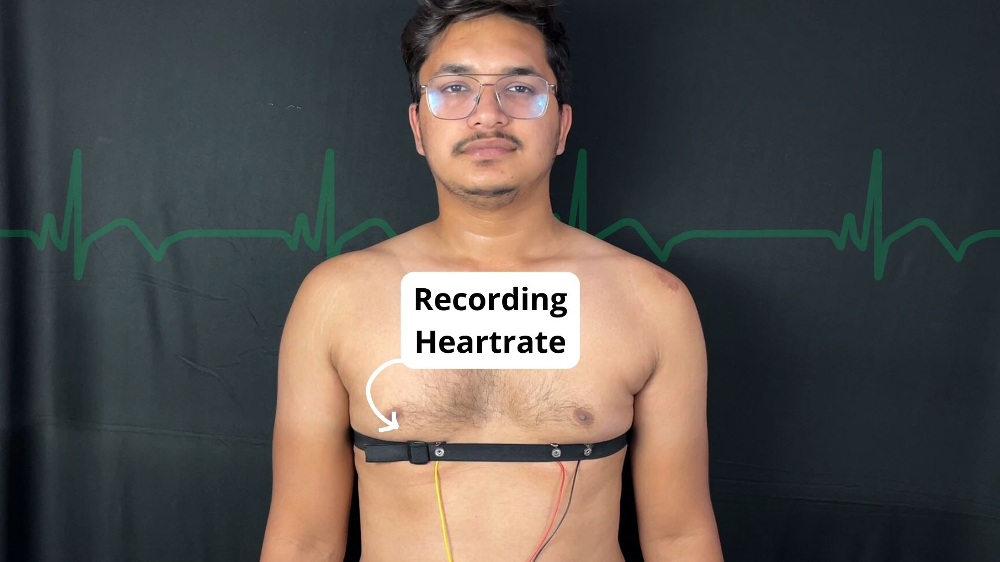

# Measuring Heart Rate Using BioAmp EXG Pill

In this project we will be measuring heart rate using BioAmp EXG Pill.

## What is Electrocardiography (ECG)?

Electrocardiography is the measurement of electrical activity in the heart.

## What is a heartrate?

Heartbeat is the number of times per minute that the heart contracts or beats. For most adults, a target resting heart rate is between 60 and 100 beats per minute.

### About BioAmp EXG Pill:

BioAmp EXG Pill is one of a kind pill-size chip that can record publication-grade biopotential signals from your body be it from the heart (ECG), brain (EEG), eyes (EOG), and muscles (EMG).

The entire BioAmp series of sensors from Upside Down Labs is designed in a way to teach you the basics of the instrumentation amplifier, active bandpass filtering, soldering, programming, neuroscience, HCI, and BCI just to name a few concepts.

## Supplies

### HARDWARE:

1 x BioAmp EXG Pill (with JST PH 2.0 connector and a header pin)

1 x BioAmp Cable

3 x Gel Electrodes

3 x Jumper Cables

1 x Arduino Uno / Maker Uno with USB Cable (You can also use any other microcontroller board with an ADC)

1 x Nuprep Skin Preparation Gel

1 x Wet wipe

1 x Heart BioAmp Band (optional)

1 x Electrode Gel (only if using Heart BioAmp Band)

### SOFTWARE:
Arduino IDE

**Note:** You can either get DIY Neuroscience Kit Basic or BioAmp EXG Pill Packs by clicking the links below:

DIY Neuroscience Kit Basic ([Upside Down Labs Store](https://store.upsidedownlabs.tech/product/diy-neuroscience-kit-basic/) |
[Tindie Store](https://www.tindie.com/products/upsidedownlabs/diy-neuroscience-kit-basic/) | [Amazon Store](https://www.amazon.in/dp/B0CBMTHLDJ?ref_=cm_sw_r_cp_ud_dp_E2A1CNJXN6ACZ4THA5ZQ))

BioAmp EXG Pill Pack ([Upside Down Labs Store](https://store.upsidedownlabs.tech/product/bioamp-exg-pill/) | [Tindie Store](https://www.tindie.com/products/upsidedownlabs/bioamp-exg-pill-sensor-for-ecg-emg-eog-or-eeg/) )

BioAmp EXG Pill - EXG Explorer Pack ([Upside Down Labs Store](https://store.upsidedownlabs.tech/product/bioamp-exg-pill/) |
[Tindie Store](https://www.tindie.com/products/upsidedownlabs/bioamp-exg-pill-x2-sensor-for-ecg-emg-eog-eeg/) | [Amazon Store](https://www.amazon.in/dp/B0B29CCPQB?ref_=cm_sw_r_cp_ud_dp_4D6ZTBD5RRASS5QM6HK1&th=1))

## Step 1: Assembly

The BioAmp EXG Pill comes presoldered with DIY Neuroscience Kit Basic but in case you are getting BioAmp EXG Pill seperately then you will have to assemble it for this project by soldering the header pins and JST PH 2.0 connector as shown in the diagram.

## Step 2: Configuration for ECG

BioAmp EXG Pill is by default configured for recording EEG or EOG but if you want to record good quality ECG or EMG, then it is recommended to configure it by making a solder joint as shown in the image above.

***Note:*** Even without making the solder joint the BioAmp EXG Pill is capable of recording ECG or EMG as well but the signals would be more accurate if you configure it.

## Step 3: Connecting Electrode Cable

Connect the BioAmp Cable to BioAmp EXG Pill. We have different variants of the BioAmp Cable so don't go with the color coding and focus on the REF, IN+ and IN- written on the BioAmp EXG Pill.

## Step 4: Skin Preparation

Apply Nuprep Skin Preparation Gel on the skin surface where electrodes would be placed to remove dead skin cells and clean the skin from dirt. After rubbing the skin surface thoroughly, clean it with a wet wipe.

### About Nuprep Gel:

Nuprep skin preparation gel is a mildly abrasive, highly conductive gel that should be applied before placing the electrodes on the skin to improve measurements. When applied gently, it strips away the top layer of skin and moistens the underlying skin layer which reduces the skin impedance with minimal skin irritation and discomfort.

## Step 5: Electrode Placements

So now we have 2 options to measure the ECG signals, either using the gel electrodes or using dry electrode based ECG band. You can try both of them one by one.

### Option 1 - Measuring ECG using Gel electrodes:

1. Connect the BioAmp Cable to gel electrodes,
2. Peel the plastic backing from electrodes
3. Place the IN- cable on the left side, IN+ in the middle and REF (reference) on the far right side as shown above.

### Option 2 - Measuring ECG using Heart BioAmp Band, a dry electrode based ECG band:

1. Place the IN- cable on the left side, IN+ in the middle and REF (reference) on the far right side as shown above.
2. Now put a small drop of electrode gel on the dry electrodes between the skin and metallic part of BioAmp Cable to get the best results.

## Step 6: Connections

Connect BioAmp EXG Pill to Maker Uno using the jumper cables as directed below:

- VCC to 5V
- GND to GND
- OUT to A0

***Note:*** BE VERY CAREFUL and follow the above diagram while making the connections between your BioAmp EXG Pill & Maker Uno, especially the GND and VCC else it may damage the sensor.

## Step 7: Download Arduino IDE
Download the Arduino IDE from the link given below:

https://www.arduino.cc/en/software

(We have used Arduino IDE version 1.8.19 for this project)

After downloading, connect the Maker Uno to your laptop using the USB Cable (Type A to Type B)

***Note:*** Make sure your laptop is not connected to a charger and sit 5m away from any AC appliances for best signal acquisition.

## Step 8: Coding Time!
Copy paste the Arduino Sketch given below in Arduino IDE.     

HeartRate Detection: https://github.com/upsidedownlabs/Heart-BioAmp-Arduino-Firmware/blob/main/3_HeartRateDetection/3_HeartRateDetection.ino

After flashing the code, open the serial monitor and wait for 22 seconds to see the value of heart rate.

## Step 9: Enjoy

<iframe width="100%" height="444" src="https://www.youtube.com/embed/PvWtCFNK3_s?si=Q9RoDCHXmS4lJy4F&autoplay='0" title="YouTube video player" frameborder="0" allow="accelerometer; autoplay; clipboard-write; encrypted-media; gyroscope; picture-in-picture; web-share" allowfullscreen></iframe>

The project is complete!!

Let us know your feedback in the comments and feel free to ask any questions.

You can also mail us at support@upsidedownlabs.tech for any kind of support while you are making this project.