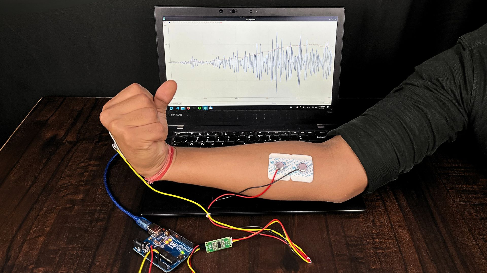
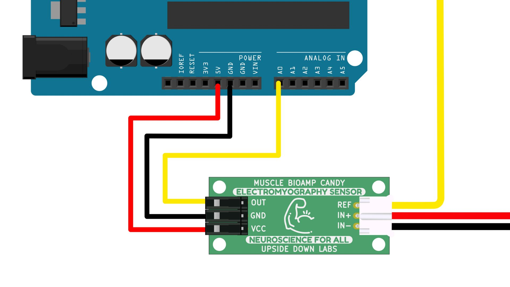
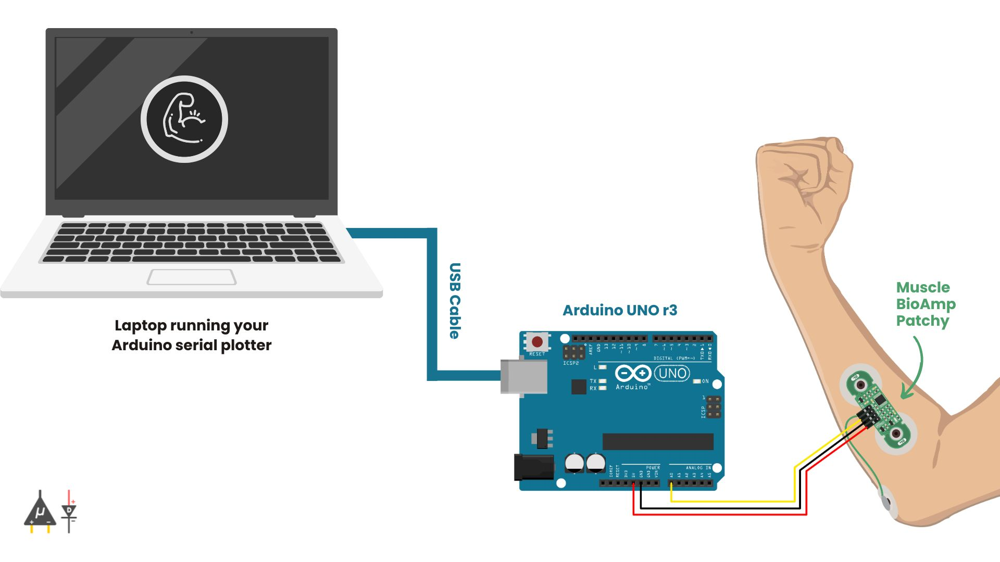

# Visualizing Muscle Signals (EMG) 

import Tabs from '@theme/Tabs';
import TabItem from '@theme/TabItem';

<Tabs>
  <TabItem value="Muscle BioAmp BisCute" label="Muscle BioAmp BisCute" default>

Muscle sensors are typically quite expensive as they are medical-grade diagnostic devices. But with an affordable DIY Muscle Sensor like Muscle BioAmp BisCute, you can record biopotential signals from muscles, conduct experiments and make amazing projects at a fraction of the cost of a professional EMG machine.

## What is Electromyography (EMG)?

Electromyography is a technique that measures muscle response or electrical activity in response to a nerve’s stimulation of the muscle. We can use this electrical activity to detect neuromuscular abnormalities or create solutions for some crazy real-world problems like making artificial limb for amputees.

### About Muscle BioAmp BisCute:

Muscle BioAmp BisCute is the most affordable DIY muscle sensor that allows you to create a Human-Computer Interface (HCI) with ease and in the process of building your own BisCute, you learn what goes into making a functional biopotential amplifier that can be used for amplifying sub mV signals created by muscles inside your body to a level a microcontroller unit (MCU) can understand.

The entire BioAmp series of sensors from Upside Down Labs is designed in a way to teach you the basics of the instrumentation amplifier, active bandpass filtering, soldering, programming, neuroscience, HCI, and BCI just to name a few concepts.

## Supplies
### HARDWARE:

1 x Muscle BioAmp BisCute Kit ([Upside Down Labs Store](https://store.upsidedownlabs.tech/product/muscle-bioamp-biscute-diy/) | [Amazon India](https://www.amazon.in/dp/B0BDRFL2VY/ref=brnd_rev_mng) | [Tindie Store](https://www.tindie.com/products/upsidedownlabs/muscle-bioamp-biscute-diy-muscle-sensor/))

- The Kit includes:
    - Muscle BioAmp BisCute PCB x 1
    - Passive Components
        - Ceramic capacitors.
        - Electrolytic capacitors
        - Resistors
        - Quad OpAmp
    - BioAmp Cable (50cm) x 1
    - Jumper Wires x 3
    - Gel Electrodes x 3
    - Muscle BioAmp Band x 1

1 x Arduino UNO with USB cable (Type A to Type B)

Soldering iron and other equipments to solder the passive components on the PCB

### SKIN PREPARATION KIT & ELECTRODE GEL:

1 x NuPrep skin preparation gel ([Upside Down Labs Store](https://store.upsidedownlabs.tech/product/nuprep-gel/)  | [Tindie Store](https://www.tindie.com/products/upsidedownlabs/nuprep-skin-preparation-gel/))

1 x Wet wipe

1 x Electrode Gel (only if using Muscle BioAmp Band) ([Upside Down Labs Store](https://store.upsidedownlabs.tech/product/electrode-gel/)  | [Tindie Store](https://www.tindie.com/products/upsidedownlabs/electrode-gel-250ml/))

### SOFTWARE:

Arduino IDE

## Step 1: Assembly

<iframe width="100%" height="444" src="https://www.youtube.com/embed/2dzW6pVT1L8?feature=oembed&autoplay=0" title="YouTube video player" frameborder="0" allow="accelerometer; autoplay; clipboard-write; encrypted-media; gyroscope; picture-in-picture; web-share" allowfullscreen></iframe> 

As Muscle BioAmp BisCute is a DIY muscle sensor, so first of all you have to assemble all the passive components on the PCB.

The interactive BOM can be found on the link below:

https://upsidedownlabs.github.io/Muscle-BioAmp-BisCute/

If you don't know how to solder then you may get the SMD version of Muscle BioAmp BisCute which is Muscle BioAmp Candy, a candy size muscle sensor 1 x Muscle BioAmp BisCute Kit ([Upside Down Labs Store](https://store.upsidedownlabs.tech/product/muscle-bioamp-candy/) | [Amazon India](https://www.amazon.in/Muscle-Accessories-Upside-Down-Labs/dp/B09ZDZVCT7/ref=sr_1_3?crid=3B0OFI7LBCGWV&keywords=bioamp&qid=1691132541&sprefix=bioamp%2Caps%2C208&sr=8-3) | [Tindie Store](https://www.tindie.com/products/upsidedownlabs/muscle-bioamp-candy/))

## Step 2: Connecting Electrode Cable

Connect the BioAmp Cable to Muscle BioAmp BisCute. We have different variants of the BioAmp Cable so don't go with the color coding and focus on the REF, IN+ and IN- written on the Muscle BioAmp BisCute.

**Note:**  Don't place the electrodes on the skin at this moment.

## Step 3: Skin Preparation

Apply Nuprep Skin Preparation Gel on the skin surface where electrodes would be placed to remove dead skin cells and clean the skin from dirt. After rubbing the skin surface thoroughly, clean it with a wet wipe.

### About Nuprep Gel:

Nuprep skin preparation gel is a mildly abrasive, highly conductive gel that should be applied before placing the electrodes on the skin to improve measurements. When applied gently, it strips away the top layer of skin and moistens the underlying skin layer which reduces the skin impedance with minimal skin irritation and discomfort.

## Step 4: Electrode Placements

We have 2 options to measure the EMG signals, either using the gel electrodes or using dry electrode based EMG band. You can try both of them one by one.

### Measuring EMG using Gel electrodes:

1. Connect the BioAmp Cable to gel electrodes,
2. Peel the plastic backing from electrodes
3. Place the IN+ and IN- cables on the arm near the ulnar nerve & REF (reference) at the back of your hand.

### Measuring EMG using Muscle BioAmp Band, a dry electrode based EMG band:

1. Connect the BioAmp Cable to Muscle BioAmp Band in a way such that IN+ and IN- are placed on the arm near the ulnar nerve & REF (reference) on the far side of the band.
2. Wear the band on your arm as shown in the gif above.
3. Now put a small drop of electrode gel between the skin and metallic part of BioAmp Cable to get the best results.

## Step 5: Connections

Connect Muscle BioAmp BisCute to Arduino Uno using the jumper cables as directed below:

- VCC to 5V
- GND to GND
- OUT to A0
**Note:** BE VERY CAREFUL and follow the above diagram while making the connections between your Muscle BioAmp BisCute & Arduino Uno, especially the GND and VCC else it may damage the sensor.

## Step 6: Download Arduino IDE

Download the Arduino IDE from the link given below:

https://www.arduino.cc/en/software

(We have used Arduino IDE version 1.8.19 for this project)

After downloading, connect the Arduino Uno to your laptop using the USB Cable (Type A to Type B)

**Note:** Make sure your laptop is not connected to a charger and sit 5m away from any AC appliances for best signal acquisition.

## Step 7: Coding Time!
Copy paste any one of the Arduino Sketches given below in Arduino IDE:

EMG Envelop: https://github.com/upsidedownlabs/BioAmp-EXG-Pill/blob/main/software/EMGEnvelop/EMGEnvelop.ino

EMG Filter: https://github.com/upsidedownlabs/BioAmp-EXG-Pill/blob/main/software/EMGFilter/EMGFilter.ino

After flashing the code, open the serial plotter to visualize the EMG signals.

## Step 8: Enjoy & Flex Your Arm

<iframe width="100%" height="444" src="https://www.youtube.com/embed/yWej1uOHFiA?feature=oembed&autoplay=0" title="YouTube video player" frameborder="0" allow="accelerometer; autoplay; clipboard-write; encrypted-media; gyroscope; picture-in-picture; web-share" allowfullscreen></iframe> 

Enjoy, finally you have completed the project. Now flex your arm to visualize the muscle signals in real time on your laptop. Similarly you can try to record EMG from other parts of your body like biceps, triceps, cheeks, thighs, etc.

You are all set to explore on your own and make amazing HCI projects at the comfort zone of your home.

## Step 9: Complete Video Guide

<iframe width="100%" height="444" src="https://www.youtube.com/embed/ujFsAE0E0nk?feature=oembed&autoplay=0" title="YouTube video player" frameborder="0" allow="accelerometer; autoplay; clipboard-write; encrypted-media; gyroscope; picture-in-picture; web-share" allowfullscreen></iframe> 

You can also watch this complete video guide of this project.

Let us know your feedback in the comments and feel free to ask any questions.

You can also mail us at support@upsidedownlabs.tech for any kind of support while you are making this project.

    
  </TabItem>
  <TabItem value="Muscle BioAmp Candy" label="Muscle BioAmp Candy">

In this tutorial, we are going to show you how to create a simple EMG system at your home so that you can easily record and visualize muscle signals in real-time using Muscle BioAmp Candy (candy-size EMG sensor) and Arduino Uno.

But before moving forward, let's understand a brief about Electromyography.

## What is Electromyography (EMG)?

Electromyography is a technique that measures muscle response or electrical activity in response to a nerve’s stimulation of the muscle. We can use this electrical activity to detect neuromuscular abnormalities or create solutions for some crazy real-world problems like making artificial limbs for amputees.

### About Muscle BioAmp Candy:

Muscle BioAmp Candy is a candy-size EMG sensor that can record minute electrical signals from the surface of our muscles and amplify them to a level a microcontroller unit (MCU) can understand.

The entire BioAmp series of sensors from Upside Down Labs is designed to teach you the basics of the instrumentation amplifier, active bandpass filtering, soldering, programming, neuroscience, HCI, and BCI to name a few concepts.

## Supplies

### HARDWARE:

1 x Muscle BioAmp Candy Kit ([Upside Down Labs Store](https://store.upsidedownlabs.tech/product/muscle-bioamp-candy/) |
 [Amazon Store](https://www.amazon.in/dp/B09ZDZVCT7?ref=myi_title_dp) | [Tindie Store](https://www.tindie.com/products/upsidedownlabs/muscle-bioamp-candy/))

- The Kit includes:
    - Muscle BioAmp Candy x 1
    - BioAmp Cable (50cm) x 1
    - Jumper Wires x 3
    - Gel Electrodes x 3
    - Muscle BioAmp Band x 1

1 x Arduino uno with USB cable (Type A to Type B)

### SKIN PREPARATION KIT & ELECTRODE GEL:

1 x NuPrep skin preparation gel ([Upside Down Labs Store](https://store.upsidedownlabs.tech/product/nuprep-gel/) | [Tindie Store](https://www.tindie.com/products/upsidedownlabs/nuprep-skin-preparation-gel/))

1 x Wet wipe

1 x Electrode Gel ([Upside Down Labs Store](https://store.upsidedownlabs.tech/product/electrode-gel/) | [Tindie Store](https://www.tindie.com/products/upsidedownlabs/electrode-gel-250ml/))

### SOFTWARE:

Arduino IDE

## Step 1: Connecting Electrode Cable

Connect the BioAmp Cable to Muscle BioAmp BisCute as shown in the connection diagram. We have different variants of the BioAmp Cable so don't go with the color coding and focus on the REF, IN+ and IN- written on the Muscle BioAmp BisCute.

## Step 2: Skin Preparation

Apply Nuprep Skin Preparation Gel on the skin surface where electrodes would be placed to remove dead skin cells and clean the skin from dirt. After rubbing the skin surface thoroughly, clean it with a wet wipe.

### About Nuprep Gel:
Nuprep skin preparation gel is a mildly abrasive, highly conductive gel that should be applied before placing the electrodes on the skin to improve measurements. When applied gently, it strips away the top layer of skin and moistens the underlying skin layer which reduces the skin impedance with minimal skin irritation and discomfort.

## Step 3: Electrode Placements

We have 2 options to measure the EMG signals, either using the gel electrodes or using dry electrode based EMG band. You can try both of them one by one.

### Measuring EMG using Gel electrodes:

1. Connect the BioAmp Cable to gel electrodes,
2. Peel the plastic backing from electrodes
3. Place the IN+ and IN- cables on the arm near the ulnar nerve & REF (reference) at the back of your hand as shown in the connection diagram.

### Measuring EMG using Muscle BioAmp Band, a dry electrode based EMG band:

1. Connect the BioAmp Cable to Muscle BioAmp Band in a way such that IN+ and IN- are placed on the arm near the ulnar nerve & REF (reference) on the far side of the band.
2. Now put a small drop of electrode gel between the skin and metallic part of BioAmp Cable to get the best results.

## Step 4: Connections

Connect Muscle BioAmp Candy to Arduino Uno using the jumper cables as directed below:

- VCC to 5V
- GND to GND
- OUT to A0

**Note:** BE VERY CAREFUL and follow the above diagram while making the connections between your Muscle BioAmp Candy & Arduino Uno, especially the GND and VCC else it may damage the sensor.

## Step 5: Download Arduino IDE
Download the Arduino IDE from the link given below:

https://www.arduino.cc/en/software

(We have used Arduino IDE version 1.8.19 for this project)

After downloading, connect the Arduino Uno to your laptop using the USB Cable (Type A to Type B)

**Note:** Make sure your laptop is not connected to a charger and sit 5m away from any AC appliances for best signal acquisition.

## Step 6: Coding Time!
Copy paste any one of the Arduino Sketches given below in Arduino IDE:

EMG Envelop: https://github.com/upsidedownlabs/BioAmp-EXG-Pill/blob/main/software/EMGEnvelop/EMGEnvelop.ino

EMG Filter: https://github.com/upsidedownlabs/BioAmp-EXG-Pill/blob/main/software/EMGFilter/EMGFilter.ino

After flashing the code, open the serial plotter to visualize the EMG signals.

## Step 7: Enjoy & Flex Your Arm

Enjoy, finally you have completed the project. Now flex your arm to visualize the muscle signals in real time on your laptop. Similarly you can try to record EMG from other parts of your body like biceps, triceps, cheeks, thighs, etc.

You are all set to explore on your own and make amazing HCI projects at the comfort zone of your home.

## Step 8: Complete Video Guide

<iframe width="100%" height="444" src="https://www.youtube.com/embed/lPX2TGBcHOA?feature=oembed&autoplay=0" title="YouTube video player" frameborder="0" allow="accelerometer; autoplay; clipboard-write; encrypted-media; gyroscope; picture-in-picture; web-share" allowfullscreen></iframe> 

You can also watch this complete video guide of this project.

Let us know your feedback in the comments and feel free to ask any questions.

You can also mail us at support@upsidedownlabs.tech for any kind of support while you are making this project.

    
  </TabItem>
  <TabItem value="Muscle BioAmp Patchy" label="Muscle BioAmp Patchy">

In this tutorial we are going to show you how to create a simple EMG system at your home so that you can easily record and visualize muscle signals in real time using Muscle BioAmp Patchy (wearable muscle sensor) and Arduino Uno.

But before moving forward, let's understand a brief about Electromyography.

## What is Electromyography (EMG)?
Electromyography (EMG) is a technique for evaluating and recording the electrical activity produced by skeletal muscles.

Some applications of EMG:

1. Prosthetic hands, 
2. Human augmentation, 
3. Games controllers, 
4. Rehabilitation and 
5. Physical therapy
Even doctors are using them for the diagnosis of various neuromuscular ailments.

Recently, it was in the news that [Meta is working on wearable EMG sensors](https://tech.facebook.com/reality-labs/2021/03/inside-facebook-reality-labs-wrist-based-interaction-for-the-next-computing-platform/) to track user movements in the metaverse.

### About Muscle BioAmp Patchy:

Muscle BioAmp Patchy is a small **wearable muscle sensor** for precise EMG sensing. It can be snapped directly to the electrodes, eliminating electrode cables.

## Supplies

## HARDWARE

1 x Muscle BioAmp Patchy Kit ([Upside Down Labs Store](https://store.upsidedownlabs.tech/product/muscle-bioamp-patchy-v0-2/) | [Amazon India](https://www.amazon.in/dp/B0C4P2JB7J?ref=myi_title_dp&th=1) | [Tindie India](https://www.tindie.com/products/upsidedownlabs/muscle-bioamp-patchy-wearable-muscle-sensor/))

The kit will include:
* 1 Muscle BioAmp Patchy,
* 1 Reference Cable,
* 3 Jumper Wires,
* 3 Boxy Gel Electrodes

1 x Arduino Uno with USB Cable

1 x Nuprep Skin Preparation Gel ([Upside Down Labs Store](https://store.upsidedownlabs.tech/product/nuprep-gel/) | [Tindie Store](https://www.tindie.com/products/upsidedownlabs/nuprep-skin-preparation-gel/))

1 x Wet wipe

## SOFTWARE:

Ardiuno IDE

## Step 1: Connecting Reference Cable

Connect the reference cable to the Muscle BioAmp Patchy as shown in the above diagram.

## Step 2: Connecting Muscle BioAmp Patchy to Gel Electrodes

Connect the Muscle BioAmp Patchy to gel electrodes (Don't peel the plastic from the electrodes at this moment).

## Step 3: Skin Preparation

Apply Nuprep Skin Preparation Gel on the skin surface where electrodes would be placed to remove dead skin cells and clean the skin from dirt. After rubbing the skin surface thoroughly, clean it with a wet wipe.

### About Nuprep Gel:

Nuprep skin preparation gel is a mildly abrasive, highly conductive gel that should be applied before placing the electrodes on the skin to improve measurements. When applied gently, it strips away the top layer of skin and moistens the underlying skin layer which reduces the skin impedance with minimal skin irritation and discomfort. This enhances the performance of the monitoring electrode and virtually eliminates problems such as diaphoresis and muscle artifacts.

## Step 4: Electrode Placements

Now peel off the plastic backing from the gel electrodes and place the Muscle BioAmp Patchy on the muscle from where you want to record muscle signals (EMG). In this project, we are targeting the ulnar nerve on the forearm.

## Step 5: Connections

Connect the Muscle BioAmp Patchy to your Arduino Uno using jumper cables as directed below:

1. OUT to A0
2. GND to GND
3. VCC to 5V

## Step 6: Download Arduino IDE

Download the Arduino IDE from the link given below:

https://www.arduino.cc/en/software

(We have used Arduino IDE version 1.8.19 for this project)

After downloading, connect the Arduino Uno to your laptop using the USB Cable (Type A to Type B)

**Note:** Make sure your laptop is not connected to a charger and sit 5m away from any AC appliances for best signal acquisition.

## Step 7: Check All the Conections

Now that you have made all the connections and downloaded the Arduino IDE. Once again check everything as shown in the diagram.

## Step 8: Coding Time!

Copy paste any one of the Arduino Sketches given below in Arduino IDE:

1. EMG Envelop: https://github.com/upsidedownlabs/BioAmp-EXG-Pill/blob/main/software/EMGEnvelop/EMGEnvelop.ino
2. EMG Filter: https://github.com/upsidedownlabs/BioAmp-EXG-Pill/blob/main/software/EMGFilter/EMGFilter.ino

After flashing the code, open the serial plotter to visualize the EMG signals.

## Step 9: Flex Your Muscle

<iframe width="100%" height="444" src="https://www.youtube.com/embed/4dnCX3U7LS8?feature=oembed&autoplay=0" title="YouTube video player" frameborder="0" allow="accelerometer; autoplay; clipboard-write; encrypted-media; gyroscope; picture-in-picture; web-share" allowfullscreen></iframe> 

Now flex your arm to visualize the muscle signals in real time on your laptop. Similarly you can try to record muscle signals from other parts of your body like biceps, triceps, cheeks, thighs, etc.

You are all set to explore on your own and make amazing HCI projects at the comfort zone of your home.

Let us know your feedback in the comments and feel free to ask any questions.

You can also mail us at support@upsidedownlabs.tech for any kind of support while you are making this project.
    
  </TabItem>

  <TabItem value="Muscle BioAmp Shield" label="Muscle BioAmp Shield">

In this tutorial, we are going to show you how to create a simple EMG system at your home so that you can record the muscle signals, visualize them on LEDs and even listen to your muscles using the Arduino Uno shield for EMG, Muscle BioAmp Shield.

But before moving forward, let's understand a brief about Electromyography.

## What is Electromyography (EMG)?

Electromyography is a technique that measures muscle response or electrical activity in response to a nerve’s stimulation of the muscle. We can use this electrical activity to detect neuromuscular abnormalities or create solutions for some crazy real-world problems like making artificial limbs for amputees.

### About Muscle BioAmp Shield:

Muscle BioAmp Shield is an all-in-one Arduino Uno Shield for Electromyography (EMG). It is perfect for beginners as it can be stacked on top of Arduino Uno to record, visualize and listen to the muscle signals to make amazing Human-Computer Interface (HCI) projects. It also comes with various plug-and-play options so you can connect hundreds of devices like OLED screens, character displays, accelerometers, and servo claws to name just a few using the I2C interface.

This is one of the products in the entire BioAmp series of sensors from Upside Down Labs which is designed in a way to teach you the basics of the instrumentation amplifier, active bandpass filtering, soldering, programming, neuroscience, Human-Computer Interface (HCI), Brain-Computer Interface (BCI), etc.

## Supplies
### HARDWARE:

1 x Muscle BioAmp Shield Kit ([Upside Down Labs Store](https://store.upsidedownlabs.tech/product/muscle-bioamp-shield-v0-3/) | [Amazon India](https://www.amazon.in/dp/B09Z32M3PP?ref_=cm_sw_r_cp_ud_dp_N6R5671596GFW0C3JAF0) | [Tindie India](https://www.tindie.com/products/upsidedownlabs/muscle-bioamp-shield-v03-arduino-shield-for-emg/))

- The Kit includes:
    - Muscle BioAmp Shield PCB x 1
    - Components
        - Ceramic capacitors.
        - Electrolytic capacitors
        - Resistors
        - LEDs
        - Audio Jack
        - Connectors
        - Tactical Switch
        - Optocoupler
        - Quad OpAmp, etc.
    - BioAmp Cable (100cm) x 1
    - Gel Electrodes x 24
    - Muscle BioAmp Band x 1
    - BioAmp AUX Cable x 1
    - 9V Snap Cable x 1
    - STEMMA Cables x 6

1 x Arduino uno with USB cable (Type A to Type B)

1 x 9V Battery (Optional, only if you want to make the system portable)

Soldering iron and other equipments to solder the components on the PCB

### SKIN PREPARATION KIT & ELECTRODE GEL:
1 x NuPrep skin preparation gel ([Upside Down Labs Store](https://store.upsidedownlabs.tech/product/nuprep-gel/) | [Tindie India](https://www.tindie.com/products/upsidedownlabs/nuprep-skin-preparation-gel/))

1 x Wet wipe

1 x Electrode Gel (only if using Muscle BioAmp Band) ([Upside Down Labs Store](https://store.upsidedownlabs.tech/product/electrode-gel/) | [Tindie India](https://www.tindie.com/products/upsidedownlabs/electrode-gel-250ml/))

### SOFTWARE:

Arduino IDE

## Step 1: Assembly

<iframe width="100%" height="444" src="https://www.youtube.com/embed/eaIDXosPSbs?feature=oembed&autoplay=0" title="YouTube video player" frameborder="0" allow="accelerometer; autoplay; clipboard-write; encrypted-media; gyroscope; picture-in-picture; web-share" allowfullscreen></iframe> 

First of all, you have to assemble all the passive components on the Muscle BioAmp Shield PCB. For a step-by-step guide for the assembly, you can follow the video above or take a look at this ([interactive BOM](https://docs.upsidedownlabs.tech/DIY-Muscle-BioAmp-Shield/ibom.html))

## Step 2: Stacking on Arduino Uno

Stack the Muscle BioAmp Shield on top of Arduino Uno properly.

## Step 3: Connecting Electrode Cable

Connect the BioAmp Cable to Muscle BioAmp Shield as shown in the connection diagram.

**Note:** Don't place the electrodes on the skin at this moment.

## Step 4: Skin Preparation

Apply Nuprep Skin Preparation Gel on the skin surface where electrodes would be placed to remove dead skin cells and clean the skin from dirt. After rubbing the skin surface thoroughly, clean it with a wet wipe.

### About Nuprep Gel:

Nuprep skin preparation gel is a mildly abrasive, highly conductive gel that should be applied before placing the electrodes on the skin to improve measurements. When applied gently, it strips away the top layer of skin and moistens the underlying skin layer which reduces the skin impedance with minimal skin irritation and discomfort.

## Step 5: Electrode Placements

We have 2 options to measure the EMG signals, either using the gel electrodes or using dry electrode based EMG band. You can try both of them one by one.

### Measuring EMG using Gel electrodes:

1. Connect the BioAmp Cable to gel electrodes,
2. Peel the plastic backing from electrodes
3. Place the IN+ and IN- cables on the arm near the ulnar nerve & REF (reference) at the back of your hand.

### Measuring EMG using Muscle BioAmp Band, a dry electrode based EMG band:

1. Connect the BioAmp Cable to Muscle BioAmp Band in a way such that IN+ and IN- are placed on the arm near the ulnar nerve & REF (reference) on the far side of the band.
2. Now put a small drop of electrode gel between the skin and metallic part of BioAmp Cable to get the best results.

## Step 6: Download Arduino IDE

Download the Arduino IDE from the link given below:

https://www.arduino.cc/en/software

(We have used Arduino IDE version 1.8.19 for this project)

After downloading, connect the Arduino Uno to your laptop using the USB Cable (Type A to Type B)

**Note:** Make sure your laptop is not connected to a charger and sit 5m away from any AC appliances for best signal acquisition.

## Step 7: Coding Time!

Copy paste the Arduino Sketch given below in Arduino IDE:

1. LED Bar Graph: https://github.com/upsidedownlabs/BioAmp-EXG-Pill/blob/main/software/LEDBarGraph/LEDBarGraph.ino

After flashing the code, open the serial plotter to visualize the EMG signals.

## Step 8: Enjoy & Flex Your Arm

Now flex your arm to visualize the muscle signals (EMG) in real time on your laptop (on serial plotter of Arduino IDE) as well as on the onboard LEDs of Muscle BioAmp Shield.

More strength you apply, more the LED bar goes up.

Similarly you can try to record EMG from other parts of your body like biceps, triceps, cheeks, thighs, etc.

## Step 9: Listen to Your Muscles

Here comes the most interesting part of the project which is listening to your muscles.

You can either listen it on a speaker or wired earphones/headphones. Let's try both of them.

### Listening on a wired earphones/headphones:

1. Plug your wired earphones or headphones on the 3.5mm jack of Muscle BioAmp Shield
2. Plug it in your ears
3. Flex and listen to your muscles

### Listening on a speaker using BioAmp AUX Cable:

1. Plug the BioAmp AUX Cable on Muscle BioAmp Shield
2. Connect the BioAmp AUX cable on the speaker
3. Flex and listen to your muscles.
Isn't it AMAZING? How did you feel?

Let us know your feedback in the comments and feel free to ask any questions.

You can also mail us at support@upsidedownlabs.tech for any kind of support while you are making this project.

## Step 10: Make It Portable

Till now, the power for the EMG system was coming from the laptop via USB cable of Arduino Uno but there can be 2 ways in which you can make the system portable:

1. Using 9V battery: Directly connect a 9V battery to Muscle BioAmp Shield using a 9V snap cable.

2. Using Power Bank: Instead of connecting the USB cable of Arduino Uno to laptop, you can directly connect it to power bank.

## Step 11: Some Other Projects

<iframe width="100%" height="444" src="https://www.youtube.com/embed/kgvK51UIXdo?feature=oembed&autoplay=0" title="YouTube video player" frameborder="0" allow="accelerometer; autoplay; clipboard-write; encrypted-media; gyroscope; picture-in-picture; web-share" allowfullscreen></iframe> 

You can also make various other projects using Muscle BioAmp Shield like:

1. Controlling a servo claw by muscle signals (EMG): https://www.instructables.com/Controlling-a-Servo-Claw-With-Muscle-Signals-EMG-U/

  
    

</TabItem>
  
  <TabItem value="BioAmp Exg Pill" label="BioAmp EXG Pill">
    
  </TabItem>
</Tabs>

<!-- 

Muscle sensors are typically quite expensive as they are medical-grade diagnostic devices. But with an affordable DIY Muscle Sensor like Muscle BioAmp BisCute, you can record biopotential signals from muscles, conduct experiments and make amazing projects at a fraction of the cost of a professional EMG machine.

## What is Electromyography (EMG)?

Electromyography is a technique that measures muscle response or electrical activity in response to a nerve’s stimulation of the muscle. We can use this electrical activity to detect neuromuscular abnormalities or create solutions for some crazy real-world problems like making artificial limb for amputees.

### About Muscle BioAmp BisCute:

Muscle BioAmp BisCute is the most affordable DIY muscle sensor that allows you to create a Human-Computer Interface (HCI) with ease and in the process of building your own BisCute, you learn what goes into making a functional biopotential amplifier that can be used for amplifying sub mV signals created by muscles inside your body to a level a microcontroller unit (MCU) can understand.

The entire BioAmp series of sensors from Upside Down Labs is designed in a way to teach you the basics of the instrumentation amplifier, active bandpass filtering, soldering, programming, neuroscience, HCI, and BCI just to name a few concepts.

## Supplies
### HARDWARE:

1 x Muscle BioAmp BisCute Kit ([Upside Down Labs Store](https://store.upsidedownlabs.tech/product/muscle-bioamp-biscute-diy/) | [Amazon India](https://www.amazon.in/dp/B0BDRFL2VY/ref=brnd_rev_mng) | [Tindie Store](https://www.tindie.com/products/upsidedownlabs/muscle-bioamp-biscute-diy-muscle-sensor/))

- The Kit includes:
    - Muscle BioAmp BisCute PCB x 1
    - Passive Components
        - Ceramic capacitors.
        - Electrolytic capacitors
        - Resistors
        - Quad OpAmp
    - BioAmp Cable (50cm) x 1
    - Jumper Wires x 3
    - Gel Electrodes x 3
    - Muscle BioAmp Band x 1

1 x Arduino UNO with USB cable (Type A to Type B)

Soldering iron and other equipments to solder the passive components on the PCB

### SKIN PREPARATION KIT & ELECTRODE GEL:

1 x NuPrep skin preparation gel ([Upside Down Labs Store](https://store.upsidedownlabs.tech/product/nuprep-gel/)  | [Tindie Store](https://www.tindie.com/products/upsidedownlabs/nuprep-skin-preparation-gel/))

1 x Wet wipe

1 x Electrode Gel (only if using Muscle BioAmp Band) ([Upside Down Labs Store](https://store.upsidedownlabs.tech/product/electrode-gel/)  | [Tindie Store](https://www.tindie.com/products/upsidedownlabs/electrode-gel-250ml/))

### SOFTWARE:

Arduino IDE

## Step 1: Assembly

<iframe width="100%" height="444" src="https://www.youtube.com/embed/2dzW6pVT1L8?feature=oembed&autoplay=0" title="YouTube video player" frameborder="0" allow="accelerometer; autoplay; clipboard-write; encrypted-media; gyroscope; picture-in-picture; web-share" allowfullscreen></iframe> 

As Muscle BioAmp BisCute is a DIY muscle sensor, so first of all you have to assemble all the passive components on the PCB.

The interactive BOM can be found on the link below:

https://upsidedownlabs.github.io/Muscle-BioAmp-BisCute/

If you don't know how to solder then you may get the SMD version of Muscle BioAmp BisCute which is Muscle BioAmp Candy, a candy size muscle sensor 1 x Muscle BioAmp BisCute Kit ([Upside Down Labs Store](https://store.upsidedownlabs.tech/product/muscle-bioamp-candy/) | [Amazon India](https://www.amazon.in/Muscle-Accessories-Upside-Down-Labs/dp/B09ZDZVCT7/ref=sr_1_3?crid=3B0OFI7LBCGWV&keywords=bioamp&qid=1691132541&sprefix=bioamp%2Caps%2C208&sr=8-3) | [Tindie Store](https://www.tindie.com/products/upsidedownlabs/muscle-bioamp-candy/))

## Step 2: Connecting Electrode Cable

Connect the BioAmp Cable to Muscle BioAmp BisCute. We have different variants of the BioAmp Cable so don't go with the color coding and focus on the REF, IN+ and IN- written on the Muscle BioAmp BisCute.

**Note:**  Don't place the electrodes on the skin at this moment.

## Step 3: Skin Preparation

Apply Nuprep Skin Preparation Gel on the skin surface where electrodes would be placed to remove dead skin cells and clean the skin from dirt. After rubbing the skin surface thoroughly, clean it with a wet wipe.

### About Nuprep Gel:

Nuprep skin preparation gel is a mildly abrasive, highly conductive gel that should be applied before placing the electrodes on the skin to improve measurements. When applied gently, it strips away the top layer of skin and moistens the underlying skin layer which reduces the skin impedance with minimal skin irritation and discomfort.

## Step 4: Electrode Placements

We have 2 options to measure the EMG signals, either using the gel electrodes or using dry electrode based EMG band. You can try both of them one by one.

### Measuring EMG using Gel electrodes:

1. Connect the BioAmp Cable to gel electrodes,
2. Peel the plastic backing from electrodes
3. Place the IN+ and IN- cables on the arm near the ulnar nerve & REF (reference) at the back of your hand.

### Measuring EMG using Muscle BioAmp Band, a dry electrode based EMG band:

1. Connect the BioAmp Cable to Muscle BioAmp Band in a way such that IN+ and IN- are placed on the arm near the ulnar nerve & REF (reference) on the far side of the band.
2. Wear the band on your arm as shown in the gif above.
3. Now put a small drop of electrode gel between the skin and metallic part of BioAmp Cable to get the best results.

## Step 5: Connections

Connect Muscle BioAmp BisCute to Arduino Uno using the jumper cables as directed below:

- VCC to 5V
- GND to GND
- OUT to A0
**Note:** BE VERY CAREFUL and follow the above diagram while making the connections between your Muscle BioAmp BisCute & Arduino Uno, especially the GND and VCC else it may damage the sensor.

## Step 6: Download Arduino IDE

Download the Arduino IDE from the link given below:

https://www.arduino.cc/en/software

(We have used Arduino IDE version 1.8.19 for this project)

After downloading, connect the Arduino Uno to your laptop using the USB Cable (Type A to Type B)

**Note:** Make sure your laptop is not connected to a charger and sit 5m away from any AC appliances for best signal acquisition.

## Step 7: Coding Time!
Copy paste any one of the Arduino Sketches given below in Arduino IDE:

EMG Envelop: https://github.com/upsidedownlabs/BioAmp-EXG-Pill/blob/main/software/EMGEnvelop/EMGEnvelop.ino

EMG Filter: https://github.com/upsidedownlabs/BioAmp-EXG-Pill/blob/main/software/EMGFilter/EMGFilter.ino

After flashing the code, open the serial plotter to visualize the EMG signals.

## Step 8: Enjoy & Flex Your Arm

<iframe width="100%" height="444" src="https://www.youtube.com/embed/yWej1uOHFiA?feature=oembed&autoplay=0" title="YouTube video player" frameborder="0" allow="accelerometer; autoplay; clipboard-write; encrypted-media; gyroscope; picture-in-picture; web-share" allowfullscreen></iframe> 

Enjoy, finally you have completed the project. Now flex your arm to visualize the muscle signals in real time on your laptop. Similarly you can try to record EMG from other parts of your body like biceps, triceps, cheeks, thighs, etc.

You are all set to explore on your own and make amazing HCI projects at the comfort zone of your home.

## Step 9: Complete Video Guide

<iframe width="100%" height="444" src="https://www.youtube.com/embed/ujFsAE0E0nk?feature=oembed&autoplay=0" title="YouTube video player" frameborder="0" allow="accelerometer; autoplay; clipboard-write; encrypted-media; gyroscope; picture-in-picture; web-share" allowfullscreen></iframe> 

You can also watch this complete video guide of this project.

Let us know your feedback in the comments and feel free to ask any questions.

You can also mail us at support@upsidedownlabs.tech for any kind of support while you are making this project.

 -->
