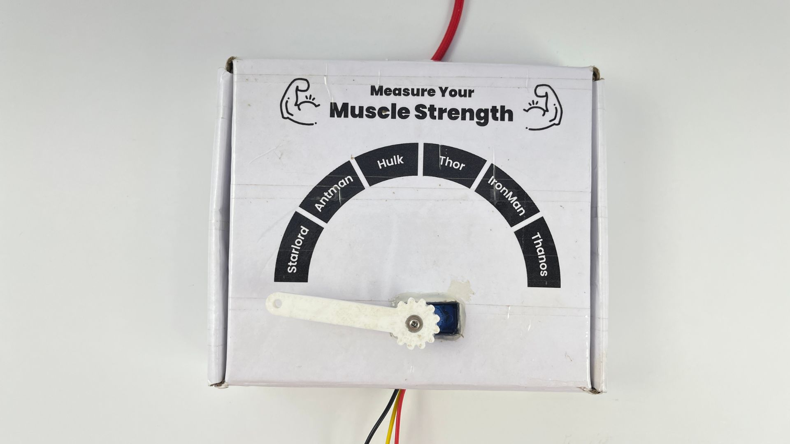

# Making a Muscle Strength Game Using Muscle BioAmp Shield & Arduino Uno

In this tutorial, you are going to make a muscle strength game at your home using the Arduino Uno shield for EMG, Muscle BioAmp Shield.

But before moving forward, let's understand a brief about Electromyography.

## What is Electromyography (EMG)?

Electromyography is a technique that measures muscle response or electrical activity in response to a nerve’s stimulation of the muscle. We can use this electrical activity to detect neuromuscular abnormalities or create solutions for some crazy real-world problems like making artificial limbs for amputees.

### About Muscle BioAmp Shield:

Muscle BioAmp Shield is an all-in-one Arduino Uno Shield for Electromyography (EMG). It is perfect for beginners as it can be stacked on top of Arduino Uno to record, visualize and listen to the muscle signals to make amazing Human-Computer Interface (HCI) projects. It also comes with various plug-and-play options so you can connect hundreds of devices like OLED screens, character displays, accelerometers, and servo claws to name just a few using the I2C interface.

This is one of the products in the entire BioAmp series of sensors from Upside Down Labs which is designed in a way to teach you the basics of the instrumentation amplifier, active bandpass filtering, soldering, programming, neuroscience, Human-Computer Interface (HCI), Brain-Computer Interface (BCI), etc.

## Supplies

### HARDWARE:

1 x Muscle BioAmp Shield Kit ([Upside Down Labs Store](https://store.upsidedownlabs.tech/product/muscle-bioamp-shield-v0-3/) | [Amazon India](https://www.amazon.in/dp/B09Z32M3PP?ref_=cm_sw_r_cp_ud_dp_N6R5671596GFW0C3JAF0) | [Tindie India](https://www.tindie.com/products/upsidedownlabs/muscle-bioamp-shield-v03-arduino-shield-for-emg/))

- The Kit includes:
    - Muscle BioAmp Shield PCB x 1
    - Components
        - Ceramic capacitors.
        - Electrolytic capacitors
        - Resistors
        - LEDs
        - Audio Jack
        - Connectors
        - Tactical Switch
        - Optocoupler
        - Quad OpAmp, etc.
    - BioAmp Cable (100cm) x 1
    - Gel Electrodes x 24
    - Muscle BioAmp Band x 1
    - BioAmp AUX Cable x 1
    - 9V Snap Cable x 1
    - STEMMA Cables x 6

1 x Arduino uno with USB cable (Type A to Type B)

1 x Servo Motor (SG90)

1 x Servo Pointer (3D Printed)

Glue Gun

Soldering iron and other equipments to solder the components on the PCB

### SOFTWARE:

Arduino IDE

### OTHER MATERIALS:

Cardboard box (15 x 13 x 4cm)

### SKIN PREPARATION KIT & ELECTRODE GEL:

1 x NuPrep skin preparation gel ([Upside Down Labs Store](https://store.upsidedownlabs.tech/product/nuprep-gel/) | [Tindie India](https://www.tindie.com/products/upsidedownlabs/nuprep-skin-preparation-gel/))

1 x Wet wipe

1 x Electrode Gel (only if using Muscle BioAmp Band) ([Upside Down Labs Store](https://store.upsidedownlabs.tech/product/electrode-gel/) | [Tindie India](https://www.tindie.com/products/upsidedownlabs/electrode-gel-250ml/))

## Step 1: Assembly

<iframe width="100%" height="444" src="https://www.youtube.com/embed/eaIDXosPSbs?feature=oembed&autoplay=" title="YouTube video player" frameborder="0" allow="accelerometer; autoplay; clipboard-write; encrypted-media; gyroscope; picture-in-picture; web-share" allowfullscreen></iframe> 

First of all, you have to assemble all the passive components on the Muscle BioAmp Shield PCB. For a step-by-step guide of the assembly, you can follow the video above or take a look at this [interactive BOM](https://docs.upsidedownlabs.tech/DIY-Muscle-BioAmp-Shield/ibom.html)

## Step 2: Stacking on Arduino Uno

Stack the Muscle BioAmp Shield on top of Arduino Uno properly.

## Step 3: Connecting Electrode Cable

Connect the BioAmp Cable to Muscle BioAmp Shield as shown above.

## Step 4: Connecting Servo Motor

Connect the servo motor to Muscle BioAmp Shield as shown above.

## Step 5: Downloading Arduino IDE

Download the Arduino IDE from the link given below:

https://www.arduino.cc/en/software

(We have used Arduino IDE version 1.8.19 for this project)

After downloading, connect the Arduino Uno to your laptop using the USB Cable (Type A to Type B)

***Note:*** Make sure your laptop is not connected to a charger and sit 5m away from any AC appliances for best signal acquisition.

## Step 6: Coding Time!

We lost the Arduino Sketch and seems like we will have to write it all over again. So give us just 2-3 days and we will update the code here.

## Step 7: Preparing the Box

The dimensions of the cardboard box we chose is 15 x 13 x 4 cm which gives perfect space for the Muscle BioAmp Shield and servo motor to be placed inside the enclosure/box.

After selecting the cardboard box, now it's time to design a dashboard or muscle strength bar. To make this game a bit interesting, we have made the bar which features Starlord, Antman, Hulk, Thor, IronMan and Thanos. So the ultimate goal of the game would be to become Thanos.

Now you need to make 2 holes in the box, one in the front ane one in back side for USB cable of Arduino Uno and the BioAmp Cable respectively.

The front part of the servo motor should be outside the box where the servo pointer will be assembled. To do that you can cut the cardboard box as shown in the photos above and use glue gun to fix it properly.

## Step 8: 3D Printing Servo Pointer

Now you need to 3D print the servo pointer by using the file given below and then assemble it on top of servo motor.

## Step 9: Electrode Placements

We have 2 options to measure the EMG signals, either using the gel electrodes or using dry electrode based EMG band. You can try both of them one by one.

### Measuring EMG using Gel electrodes:

1. Connect the BioAmp Cable to gel electrodes,
2. Peel the plastic backing from electrodes
3. Place the IN+ and IN- cables on the arm near the ulnar nerve & REF (reference) at the back of your hand.

### Measuring EMG using Muscle BioAmp Band, a dry electrode based EMG band:

1. Connect the BioAmp Cable to Muscle BioAmp Band in a way such that IN+ and IN- are placed on the arm near the ulnar nerve & REF (reference) on the far side of the band.
2. Now put a small drop of electrode gel between the skin and metallic part of BioAmp Cable to get the best results.

## Step 10: Connect to Power Bank
To make it a portable game, you can use power bank. To power the game, just connect the USB cable of Arduino Uno to Power Bank and you are good to go.

If you don't want to use the power bank, then directly plug the USB cable of Arduino Uno to your laptop which is not connected to any charger.

## Step 11: Measure Your Muscle Strength and Become Thanos

<iframe width="100%" height="444" src="https://www.youtube.com/embed/bSfTnFcCHYM?feature=oembed&enablejsapi=1&origin=https://www.instructables.com" title="YouTube video player" frameborder="0" allow="accelerometer; autoplay; clipboard-write; encrypted-media; gyroscope; picture-in-picture; web-share" allowfullscreen></iframe> 

The game is ready!!

Flex your muscles as much as you can to move the servo pointer from Starlord to Thanos. The more powerful you flex, the more the bar will move.

Let us know your feedback in the comments and feel free to ask any questions.

You can also mail us at support@upsidedownlabs.tech for any kind of support while you are making this project.