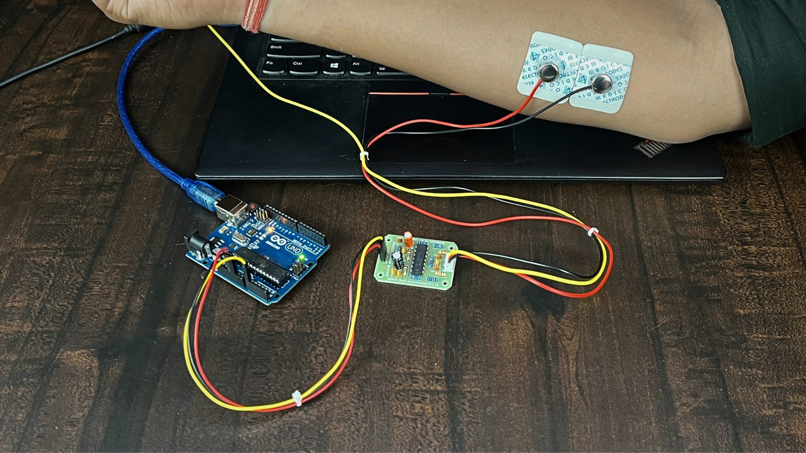

# Visualizing Muscle Signals (EMG) Using Most Affordable DIY Muscle Sensor

Muscle sensors are typically quite expensive as they are medical-grade diagnostic devices. But with an affordable DIY Muscle Sensor like Muscle BioAmp BisCute, you can record biopotential signals from muscles, conduct experiments and make amazing projects at a fraction of the cost of a professional EMG machine.

## What is Electromyography (EMG)?

Electromyography is a technique that measures muscle response or electrical activity in response to a nerve’s stimulation of the muscle. We can use this electrical activity to detect neuromuscular abnormalities or create solutions for some crazy real-world problems like making artificial limb for amputees.

### About Muscle BioAmp BisCute:

Muscle BioAmp BisCute is the most affordable DIY muscle sensor that allows you to create a Human-Computer Interface (HCI) with ease and in the process of building your own BisCute, you learn what goes into making a functional biopotential amplifier that can be used for amplifying sub mV signals created by muscles inside your body to a level a microcontroller unit (MCU) can understand.

The entire BioAmp series of sensors from Upside Down Labs is designed in a way to teach you the basics of the instrumentation amplifier, active bandpass filtering, soldering, programming, neuroscience, HCI, and BCI just to name a few concepts.

## Supplies
### HARDWARE:

1 x Muscle BioAmp BisCute Kit ([Upside Down Labs Store](https://store.upsidedownlabs.tech/product/muscle-bioamp-biscute-diy/) | [Amazon India](https://www.amazon.in/dp/B0BDRFL2VY/ref=brnd_rev_mng) | [Tindie Store](https://www.tindie.com/products/upsidedownlabs/muscle-bioamp-biscute-diy-muscle-sensor/))

- The Kit includes:
    - Muscle BioAmp BisCute PCB x 1
    - Passive Components
        - Ceramic capacitors.
        - Electrolytic capacitors
        - Resistors
        - Quad OpAmp
    - BioAmp Cable (50cm) x 1
    - Jumper Wires x 3
    - Gel Electrodes x 3
    - Muscle BioAmp Band x 1

1 x Arduino UNO with USB cable (Type A to Type B)

Soldering iron and other equipments to solder the passive components on the PCB

### SKIN PREPARATION KIT & ELECTRODE GEL:

1 x NuPrep skin preparation gel ([Upside Down Labs Store](https://store.upsidedownlabs.tech/product/nuprep-gel/)  | [Tindie Store](https://www.tindie.com/products/upsidedownlabs/nuprep-skin-preparation-gel/))

1 x Wet wipe

1 x Electrode Gel (only if using Muscle BioAmp Band) ([Upside Down Labs Store](https://store.upsidedownlabs.tech/product/electrode-gel/)  | [Tindie Store](https://www.tindie.com/products/upsidedownlabs/electrode-gel-250ml/))

### SOFTWARE:

Arduino IDE

## Step 1: Assembly

<iframe width="100%" height="444" src="https://www.youtube.com/embed/2dzW6pVT1L8?feature=oembed&autoplay=0" title="YouTube video player" frameborder="0" allow="accelerometer; autoplay; clipboard-write; encrypted-media; gyroscope; picture-in-picture; web-share" allowfullscreen></iframe> 

As Muscle BioAmp BisCute is a DIY muscle sensor, so first of all you have to assemble all the passive components on the PCB.

The interactive BOM can be found on the link below:

https://upsidedownlabs.github.io/Muscle-BioAmp-BisCute/

If you don't know how to solder then you may get the SMD version of Muscle BioAmp BisCute which is Muscle BioAmp Candy, a candy size muscle sensor 1 x Muscle BioAmp BisCute Kit ([Upside Down Labs Store](https://store.upsidedownlabs.tech/product/muscle-bioamp-candy/) | [Amazon India](https://www.amazon.in/Muscle-Accessories-Upside-Down-Labs/dp/B09ZDZVCT7/ref=sr_1_3?crid=3B0OFI7LBCGWV&keywords=bioamp&qid=1691132541&sprefix=bioamp%2Caps%2C208&sr=8-3) | [Tindie Store](https://www.tindie.com/products/upsidedownlabs/muscle-bioamp-candy/))

## Step 2: Connecting Electrode Cable

Connect the BioAmp Cable to Muscle BioAmp BisCute. We have different variants of the BioAmp Cable so don't go with the color coding and focus on the REF, IN+ and IN- written on the Muscle BioAmp BisCute.

**Note:**  Don't place the electrodes on the skin at this moment.

## Step 3: Skin Preparation

Apply Nuprep Skin Preparation Gel on the skin surface where electrodes would be placed to remove dead skin cells and clean the skin from dirt. After rubbing the skin surface thoroughly, clean it with a wet wipe.

### About Nuprep Gel:

Nuprep skin preparation gel is a mildly abrasive, highly conductive gel that should be applied before placing the electrodes on the skin to improve measurements. When applied gently, it strips away the top layer of skin and moistens the underlying skin layer which reduces the skin impedance with minimal skin irritation and discomfort.

## Step 4: Electrode Placements

We have 2 options to measure the EMG signals, either using the gel electrodes or using dry electrode based EMG band. You can try both of them one by one.

### Measuring EMG using Gel electrodes:

1. Connect the BioAmp Cable to gel electrodes,
2. Peel the plastic backing from electrodes
3. Place the IN+ and IN- cables on the arm near the ulnar nerve & REF (reference) at the back of your hand.

### Measuring EMG using Muscle BioAmp Band, a dry electrode based EMG band:

1. Connect the BioAmp Cable to Muscle BioAmp Band in a way such that IN+ and IN- are placed on the arm near the ulnar nerve & REF (reference) on the far side of the band.
2. Wear the band on your arm as shown in the gif above.
3. Now put a small drop of electrode gel between the skin and metallic part of BioAmp Cable to get the best results.

## Step 5: Connections

Connect Muscle BioAmp BisCute to Arduino Uno using the jumper cables as directed below:

- VCC to 5V
- GND to GND
- OUT to A0
**Note:** BE VERY CAREFUL and follow the above diagram while making the connections between your Muscle BioAmp BisCute & Arduino Uno, especially the GND and VCC else it may damage the sensor.

## Step 6: Download Arduino IDE

Download the Arduino IDE from the link given below:

https://www.arduino.cc/en/software

(We have used Arduino IDE version 1.8.19 for this project)

After downloading, connect the Arduino Uno to your laptop using the USB Cable (Type A to Type B)

**Note:** Make sure your laptop is not connected to a charger and sit 5m away from any AC appliances for best signal acquisition.

## Step 7: Coding Time!
Copy paste any one of the Arduino Sketches given below in Arduino IDE:

EMG Envelop: https://github.com/upsidedownlabs/BioAmp-EXG-Pill/blob/main/software/EMGEnvelop/EMGEnvelop.ino

EMG Filter: https://github.com/upsidedownlabs/BioAmp-EXG-Pill/blob/main/software/EMGFilter/EMGFilter.ino

After flashing the code, open the serial plotter to visualize the EMG signals.

## Step 8: Enjoy & Flex Your Arm

<iframe width="100%" height="444" src="https://www.youtube.com/embed/yWej1uOHFiA?feature=oembed&autoplay=0" title="YouTube video player" frameborder="0" allow="accelerometer; autoplay; clipboard-write; encrypted-media; gyroscope; picture-in-picture; web-share" allowfullscreen></iframe> 

Enjoy, finally you have completed the project. Now flex your arm to visualize the muscle signals in real time on your laptop. Similarly you can try to record EMG from other parts of your body like biceps, triceps, cheeks, thighs, etc.

You are all set to explore on your own and make amazing HCI projects at the comfort zone of your home.

## Step 9: Complete Video Guide

<iframe width="100%" height="444" src="https://www.youtube.com/embed/ujFsAE0E0nk?feature=oembed&autoplay=0" title="YouTube video player" frameborder="0" allow="accelerometer; autoplay; clipboard-write; encrypted-media; gyroscope; picture-in-picture; web-share" allowfullscreen></iframe> 

You can also watch this complete video guide of this project.

Let us know your feedback in the comments and feel free to ask any questions.

You can also mail us at support@upsidedownlabs.tech for any kind of support while you are making this project.