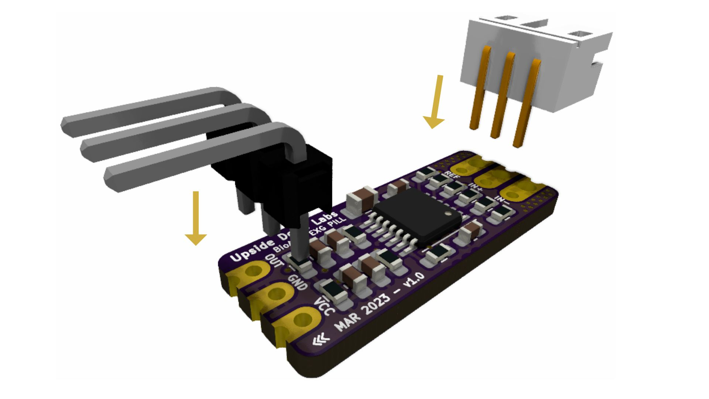

# Drowsiness Detector by Detecting EOG Signals Using BioAmp EXG Pill

In this project we will be recording electrical impulses of eyes (EOG) to make a drowsiness detector using Maker Uno and BioAmp EXG Pill.

## What is Electrooculography (EOG)?
Electrooculography (EOG) is a technique for measuring the corneo-retinal standing potential that exists between the front and the back of the human eye.The resulting signal is called the electrooculogram.

### About BioAmp EXG Pill:
BioAmp EXG Pill is one of a kind pill-size chip that can record publication-grade biopotential signals from your body be it from the heart (ECG), brain (EEG), eyes (EOG), and muscles (EMG).

The entire BioAmp series of sensors from Upside Down Labs is designed in a way to teach you the basics of the instrumentation amplifier, active bandpass filtering, soldering, programming, neuroscience, HCI, and BCI just to name a few concepts.

## Supplies

### HARDWARE:
1 x BioAmp EXG Pill (with JST PH 2.0 connector and a header pin)

1 x BioAmp Cable

3 x Gel Electrodes

3 x Jumper Cables

1 x Maker Uno with USB Cable (You can also use any other microcontroller board with an ADC)

1 x Nuprep Skin Preparation Gel

1 x Wet wipe

### SOFTWARE:
Arduino IDE

**Note:** You can either get DIY Neuroscience Kit Basic or BioAmp EXG Pill Packs by clicking the links below:

DIY Neuroscience Kit Basic ([Upside Down Labs Store](https://store.upsidedownlabs.tech/product/diy-neuroscience-kit-basic/)  | [Tindie Store](https://www.tindie.com/products/upsidedownlabs/diy-neuroscience-kit-basic/) | [Amazon India](https://www.amazon.in/dp/B0CBMTHLDJ?ref_=cm_sw_r_cp_ud_dp_E2A1CNJXN6ACZ4THA5ZQ))

BioAmp EXG Pill Pack ([Upside Down Labs Store](https://store.upsidedownlabs.tech/product/bioamp-exg-pill/)  | [Tindie Store](https://www.tindie.com/products/upsidedownlabs/bioamp-exg-pill-sensor-for-ecg-emg-eog-or-eeg/))

BioAmp EXG Pill - EXG Explorer Pack ([Upside Down Labs Store](https://store.upsidedownlabs.tech/product/bioamp-exg-pill/)  | [Tindie Store](https://www.tindie.com/products/upsidedownlabs/bioamp-exg-pill-x2-sensor-for-ecg-emg-eog-eeg/) | [Amazon India](https://www.amazon.in/dp/B0B29CCPQB?ref_=cm_sw_r_cp_ud_dp_4D6ZTBD5RRASS5QM6HK1&th=1))

**Disclaimer:** DIY Neuroscience Kit Basic includes everything you need for this project but BioAmp EXG Pill Packs does not include all the supplies and you will have to order them seperately from our stores.

## Step 1: Assembly

The BioAmp EXG Pill comes presoldered with DIY Neuroscience Kit Basic but in case you are getting BioAmp EXG Pill seperately then you will have to assemble it for this project by soldering the header pins and JST PH 2.0 connector as shown in the diagram.

## Step 2: Skin Preparation

Apply Nuprep Skin Preparation Gel on the skin surface where electrodes would be placed to remove dead skin cells and clean the skin from dirt. After rubbing the skin surface thoroughly, clean it with a wet wipe.

### About Nuprep Gel:

Nuprep skin preparation gel is a mildly abrasive, highly conductive gel that should be applied before placing the electrodes on the skin to improve measurements. When applied gently, it strips away the top layer of skin and moistens the underlying skin layer which reduces the skin impedance with minimal skin irritation and discomfort.

## Step 3: Connecting Electrode Cable

Connect the BioAmp Cable to BioAmp EXG Pill as shown in the connection diagram. We have different variants of the BioAmp Cable so don't go with the color coding and focus on the REF, IN+ and IN- written on the BioAmp EXG Pill.

## Step 4: Electrode Placements

1. Connect the BioAmp Cable to gel electrodes,
2. Peel the plastic backing from electrodes
3. Place the IN+ and IN- cables on the forehead & REF (reference) at the bony part, on the back side of your earlobe as shown above.

## Step 5: Connections

Connect BioAmp EXG Pill to Maker Uno using the jumper cables as directed below:

- VCC to 5V
- GND to GND
- OUT to A0

**Note:** BE VERY CAREFUL and follow the above diagram while making the connections between your BioAmp EXG Pill & Maker Uno, especially the GND and VCC else it may damage the sensor.

We specifically chose Maker Uno for this experinment as it is Arduino compatible board but has onboard LEDs and a buzzer.

You can also use Arduino Uno or any other development board with an ADC but in that case the buzzer and LED should be seperately connected to the board.

## Step 6: Download Arduino IDE

Download the Arduino IDE from the link given below:

https://www.arduino.cc/en/software

(We have used Arduino IDE version 1.8.19 for this project)

After downloading, connect the Maker Uno to your laptop using the USB Cable

**Note:** Make sure your laptop is not connected to a charger and sit 5m away from any AC appliances for best signal acquisition.

## Step 7: Coding Time!

Copy paste the Arduino Sketch given below in Arduino IDE.     

Drowsiness Detection: https://github.com/upsidedownlabs/Eye-BioAmp-Arduino-Firmware/blob/main/3_DrowsinessDetection/3_DrowsinessDetection.ino

## Step 8: Its Ready

<iframe width="100%" height="444" src="https://www.youtube.com/embed/h4F41mp4mWk?feature=oembed&autoplay=0" title="YouTube video player" frameborder="0" allow="accelerometer; autoplay; clipboard-write; encrypted-media; gyroscope; picture-in-picture; web-share" allowfullscreen></iframe>

The threshold for time interval between the 2 eye blinks is set to be 6000ms or 6 sec which means that whenever someone feels drowsy and doesn't blink for 6 sec, then the buzzer will beep and LEDs will glow to wake up the person.

You can change this threshold according to your requirements or preferences.

Your drowsiness detector is now ready!!

Let us know your feedback in the comments and feel free to ask any questions.

You can also mail us at support@upsidedownlabs.tech for any kind of support while you are making this project.