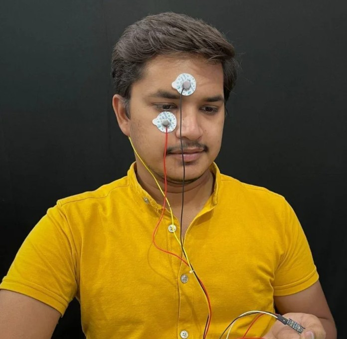
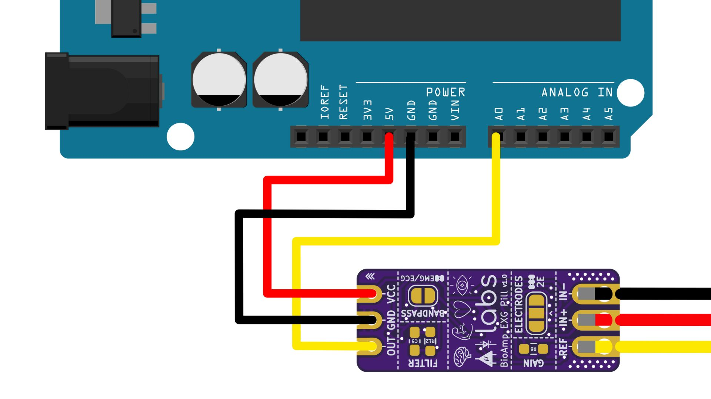

# Visualizing Electrical Impulses of Eyes (EOG) Using BioAmp EXG Pill

In this project we will be recording electrical impulses of eyes (EOG) using BioAmp EXG Pill and Arduino Uno.

## What is Electrooculography (EOG)?

Electrooculography (EOG) is a technique for measuring the corneo-retinal standing potential that exists between the front and the back of the human eye.The resulting signal is called the electrooculogram.

## About BioAmp EXG Pill:

BioAmp EXG Pill is one of a kind pill-size chip that can record publication-grade biopotential signals from your body be it from the heart (ECG), brain (EEG), eyes (EOG), and muscles (EMG).

The entire BioAmp series of sensors from Upside Down Labs is designed in a way to teach you the basics of the instrumentation amplifier, active bandpass filtering, soldering, programming, neuroscience, HCI, and BCI just to name a few concepts.

## Supplies

## HARDWARE:

1 x BioAmp EXG Pill (with JST PH 2.0 connector and a header pin)

1 x BioAmp Cable

3 x Gel Electrodes

3 x Jumper Cables

1 x Arduino Uno / Maker Uno with USB Cable (You can also use any other microcontroller board with an ADC)

1 x Nuprep Skin Preparation Gel

1 x Wet wipe

## SOFTWARE:

Arduino IDE

**Note**: You can either get DIY Neuroscience Kit Basic or BioAmp EXG Pill Packs by clicking the links below:

DIY Neuroscience Kit Basic ([Upside Down Labs Store](https://store.upsidedownlabs.tech/product/diy-neuroscience-kit-basic/) |
[Tindie Store](https://www.tindie.com/products/upsidedownlabs/diy-neuroscience-kit-basic/) | [Amazon Store](https://www.amazon.in/dp/B0CBMTHLDJ?ref_=cm_sw_r_cp_ud_dp_E2A1CNJXN6ACZ4THA5ZQ))

BioAmp EXG Pill Pack ([Upside Down Labs Store](https://store.upsidedownlabs.tech/product/bioamp-exg-pill/) | [Tindie Store](https://www.tindie.com/products/upsidedownlabs/diy-neuroscience-kit-basic/) )

BioAmp EXG Pill - EXG Explorer Pack ([Upside Down Labs Store](https://store.upsidedownlabs.tech/product/bioamp-exg-pill/) |
[Tindie Store](https://www.tindie.com/products/upsidedownlabs/diy-neuroscience-kit-basic/) | [Amazon Store](https://www.amazon.in/dp/B0B29CCPQB?ref_=cm_sw_r_cp_ud_dp_4D6ZTBD5RRASS5QM6HK1))

# Step 1: Assembly

The BioAmp EXG Pill comes presoldered with DIY Neuroscience Kit Basic but in case you are getting BioAmp EXG Pill seperately then you will have to assemble it for this project by soldering the header pins and JST PH 2.0 connector as shown in the diagram.

## Step 2: Skin Preparation

<!-- <video width="320" height="240" controls>
  <source src="eogimg4.mp4" type="video/mp4">
  </source>
</video> -->

Apply Nuprep Skin Preparation Gel on the skin surface where electrodes would be placed to remove dead skin cells and clean the skin from dirt. After rubbing the skin surface thoroughly, clean it with a wet wipe.

### About Nuprep Gel:

Nuprep skin preparation gel is a mildly abrasive, highly conductive gel that should be applied before placing the electrodes on the skin to improve measurements. When applied gently, it strips away the top layer of skin and moistens the underlying skin layer which reduces the skin impedance with minimal skin irritation and discomfort.

## Step 3: Connecting Electrode Cable

Connect the BioAmp Cable to BioAmp EXG Pill. We have different variants of the BioAmp Cable so don't go with the color coding and focus on the REF, IN+ and IN- written on the BioAmp EXG Pill.

## Step 4: Electrode Placements

Follow three simple steps to place the electrodes as given below:

1. Connect the BioAmp Cable to gel electrodes,

2. Peel the plastic backing from electrodes

3. Place the IN+ and IN- cables around your eyes & REF (reference) at the bony part, on the back side of your earlobe as shown in the diagram above.

There are 2 options to place the electrodes:

1. Left and right side of eyes to record horizontal movement or
2. Above & below your eye to record the vertical movement.

You can try both the electrode placements one by one. Let's start with Option 1 (Horizontal movement)

## Step 5: Connections

Connect BioAmp EXG Pill to Arduino Uno using the jumper cables as directed below:

1. VCC to 5V
2. GND to GND
3. OUT to A0

## Step 6: Download Arduino IDE

Download the Arduino IDE from the link given below:

[Ardiuno IDE](https://www.arduino.cc/en/software)

(We have used Arduino IDE version 1.8.19 for this project)

After downloading, connect the Arduino Uno to your laptop using the USB Cable (Type A to Type B)

**Note**: Make sure your laptop is not connected to a charger and sit 5m away from any AC appliances for best signal acquisition.

## Step 7: Coding Time!

Copy paste the Arduino Sketch given below in Arduino IDE.     

**EOG Filter**: https://github.com/upsidedownlabs/BioAmp-EXG-Pill/blob/main/software/EOGFilter/EOGFilter.ino

After flashing the code, open the serial plotter to visualize the EOG signals and detect the eye blinks.

## Step 8: Its Ready

<iframe width="100%" height="444" src="https://www.youtube.com/embed/Txo7DjUr5Tk?feature=oembed&autoplay=0" title="YouTube video player" frameborder="0" allow="accelerometer; autoplay; clipboard-write; encrypted-media; gyroscope; picture-in-picture; web-share" allowfullscreen></iframe> 

Move your eyes left and right to visualize the EOG signals. Isn't it amazing?

Now you can also try the same process for Option 2 (Vertical Movement) of electrode placements to visualize the up and down movements of eyes.

Congratulations on making this project, seems like you are are all set to explore on your own and make amazing HCI projects at the comfort zone of your home. What are you gonna make using these EOG signals?

Let us know your feedback in the comments and feel free to ask any questions.

You can also mail us at support@upsidedownlabs.tech for any kind of support while you are making this project.