.. _arduino-library-from-github:

Installing Arduino Library
######################################

Overview
**********

An Arduino library is a collection of pre-written code that adds extra functionality to your sketches. Instead of writing complex code from scratch, a library gives you ready-to-use functions, for example, to control a sensor, communicate over Bluetooth, or drive a display. You simply include the library at the top of your sketch and call its functions directly.

Arduino libraries can be installed in two ways. The easiest method is through the built-in Library Manager directly inside Arduino IDE. If the library you need is not listed there, you can download it as a ZIP file from GitHub and install it manually.

This guide covers both methods. Try Part 1 first, and fall back to Part 2 only if the library is unavailable in the Library Manager.

Part 1: Installing Using Library Manager
*******************************************

The Library Manager is the recommended way to install Arduino libraries. It lets you search, install, and update libraries directly from within Arduino IDE.

.. note::

   This part uses the **MPU6050** library as an example. MPU6050 is a commonly used IMU sensor library available in the Arduino Library Manager that lets you read accelerometer and gyroscope data. You can follow the same steps for any other library.

Step 1: Open Arduino IDE
==========================

Launch Arduino IDE on your computer and wait for it to fully load.

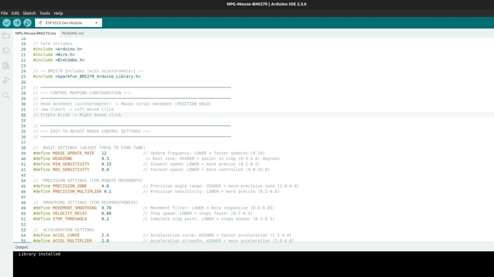

   Arduino IDE ready to use

Step 2: Open the Library Manager
===================================

You can also open the Library Manager directly with the keyboard shortcut **Ctrl + Shift + I** (Windows/Linux) or **Cmd + Shift + I** (macOS). Otherwise, follow the steps below.

**2.1** In the menu bar, click on **Sketch**. A dropdown menu will appear.

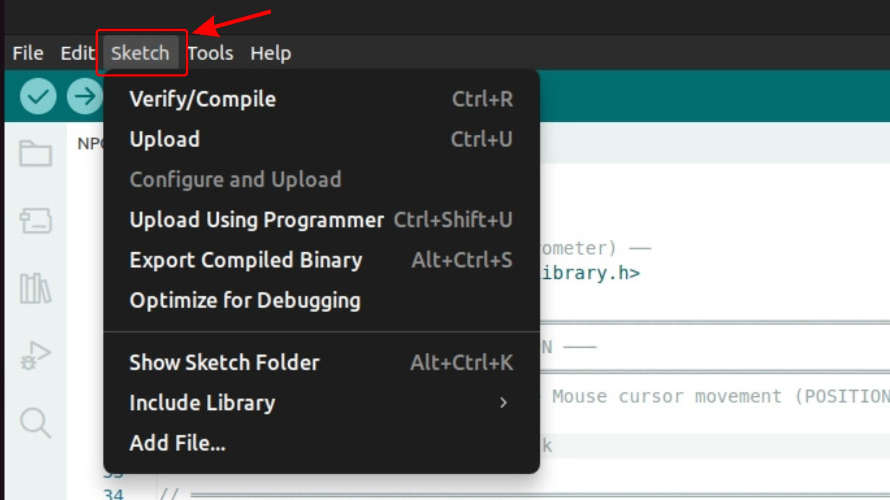

   Click on "Sketch" in the menu bar

**2.2** In the dropdown, move your mouse over **Include Library**. A submenu will slide out to the right.

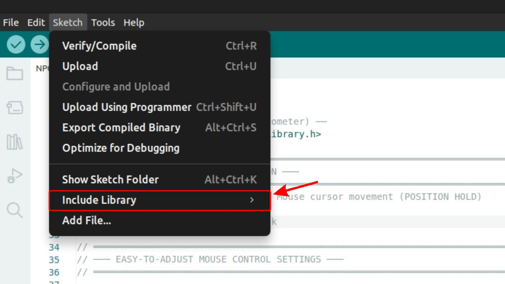

   Hover over "Include Library" to open the submenu

**2.3** From the submenu, click **Manage Libraries...**. The Library Manager panel will open on the left side of the IDE.

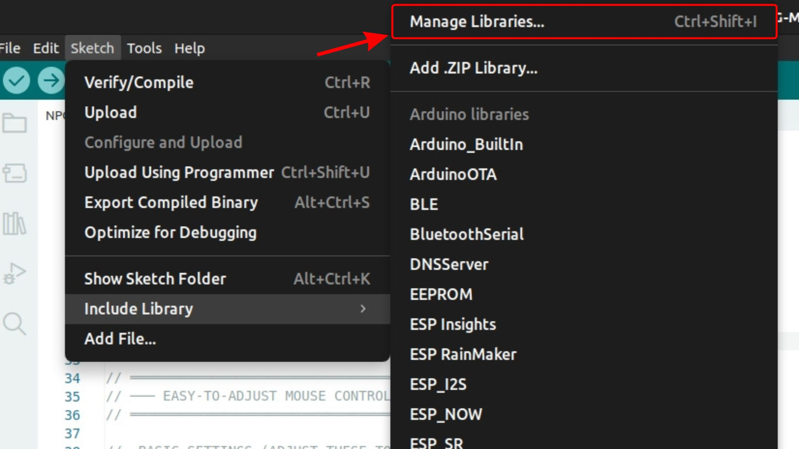

   Click "Manage Libraries..." to open the Library Manager

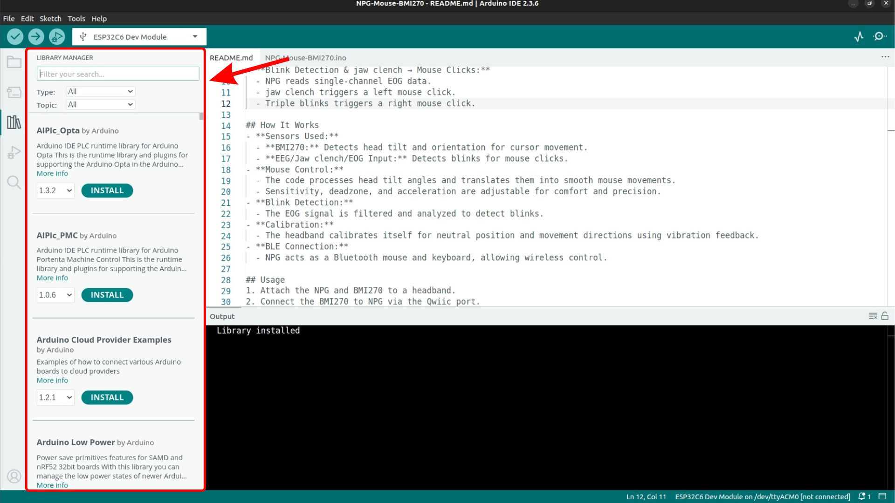

   The Library Manager panel open in Arduino IDE

Step 3: Search for the Library
=================================

In the search bar at the top of the Library Manager, type the name of the library you want to install. For example, type ``MPU6050`` to find libraries for the MPU6050 sensor.

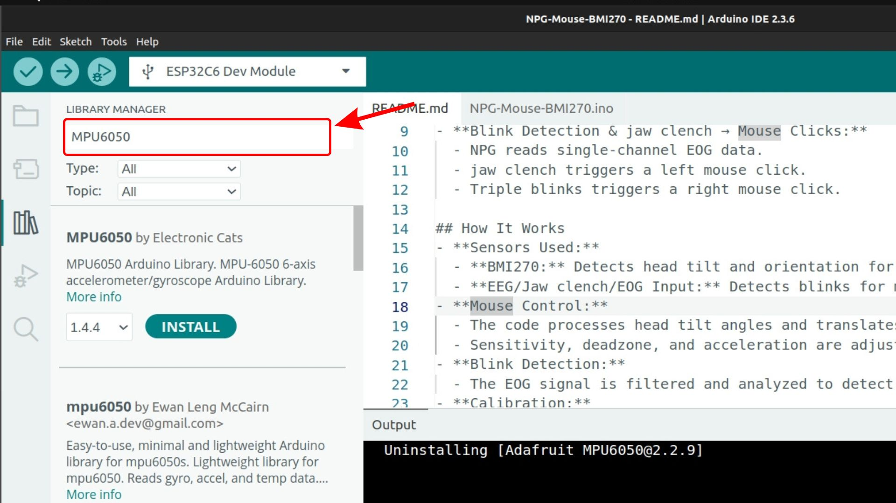

   Type the library name in the search bar

The search will return a variety of results from different authors. Review the options and choose the one that best fits your project. For example, you can use **MPU6050** by Electronic Cats or **Adafruit MPU6050** by Adafruit, depending on your requirements.

.. note::

   If the library does not appear in the search results, it is likely not published in the official Arduino Library Manager. In that case, close the Library Manager and follow :ref:`part-2-zip-install` of this guide to install it manually from GitHub.

Step 4: Install the Library
==============================

When you find the library you want in the list, click on it to expand its details. Select the version you want from the dropdown (the latest version is selected by default), then click **Install**. For example, click on **MPU6050** by Electronic Cats and click **Install**.

Arduino IDE will download and install the library. A confirmation message will appear once the installation is complete.

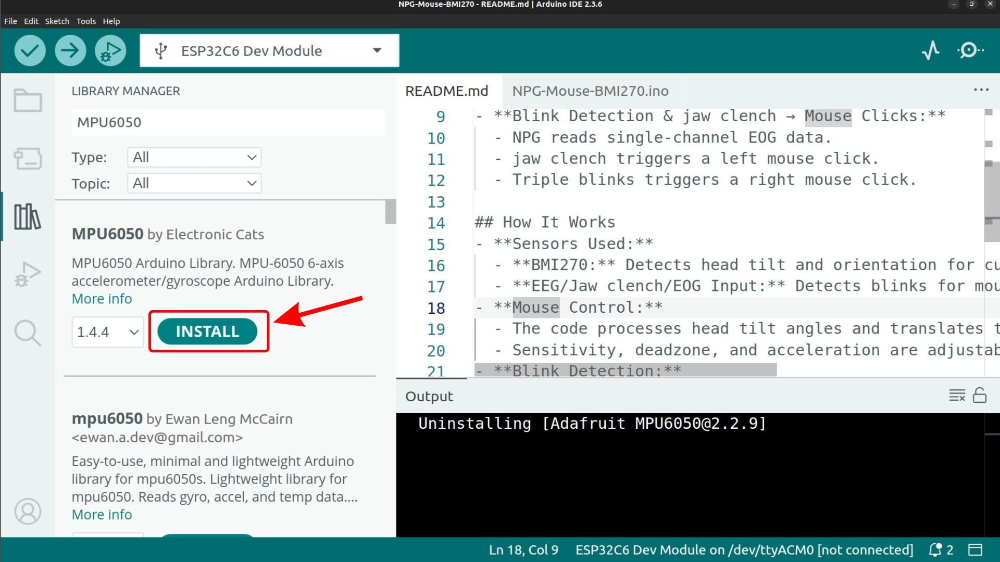

   Click Install to install the selected library
   
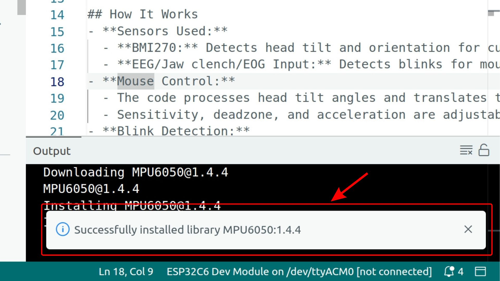

   Click Install to install the selected library. The confirmation message is shown at the bottom right of Arduino IDE after installation.

Step 5: Verify the Installation
==================================

To confirm the library was installed, click **Sketch** > **Include Library**. Scroll through the list under **Contributed Libraries** and look for the library you just installed. For example, you should see **MPU6050** listed there.

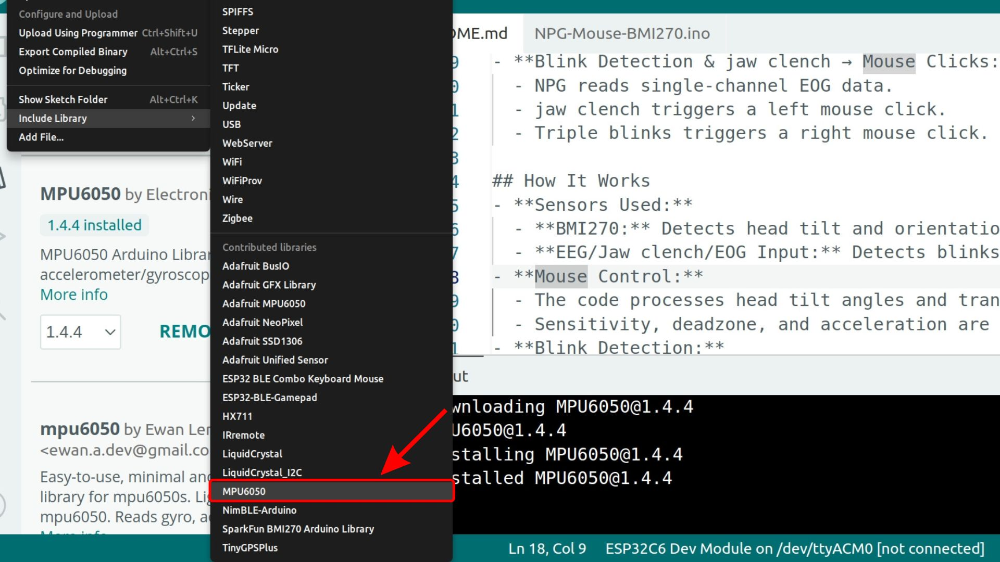

   The MPU6050 library appears under Contributed Libraries

.. _part-2-zip-install:

Part 2: Installing Using a .ZIP File from GitHub
**************************************************

.. note::

   This guide uses the `ESP32-BLE-Combo <https://github.com/upsidedownlabs/ESP32-BLE-Combo>`_ library as an example. If you search this library in the Library Manager, you will not find it because it is not published there, so you will need to install it using the steps below. You can follow the same steps for any other GitHub-hosted Arduino library. 

Some Arduino libraries are not published in the official Arduino Library Manager and are only available on GitHub. This section walks you through downloading such a library from a GitHub repository and installing it in Arduino IDE using the "Add .ZIP Library" method.

This method works for any library available as a ZIP file on GitHub. It does not require you to clone the repository or use Git commands, making it accessible for beginners.

Step 1: Open the GitHub Repository
====================================

Open your web browser and navigate to the GitHub repository of the library you want to install.

For the ESP32-BLE-Combo library, go to:
`https://github.com/upsidedownlabs/ESP32-BLE-Combo <https://github.com/upsidedownlabs/ESP32-BLE-Combo>`_

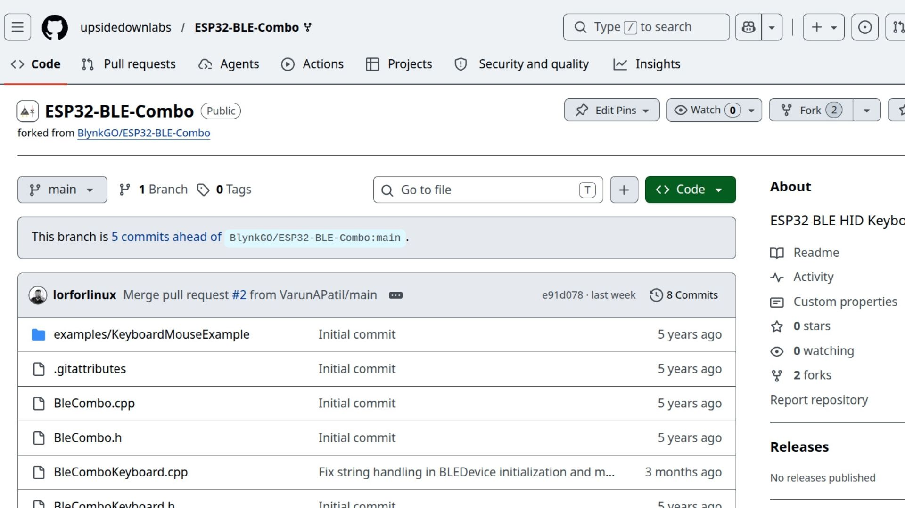

   The GitHub repository page for the library

Step 2: Download the ZIP
==========================

On the repository page, click the green **Code** button near the top-right of the file listing. A dropdown menu will appear with several options.

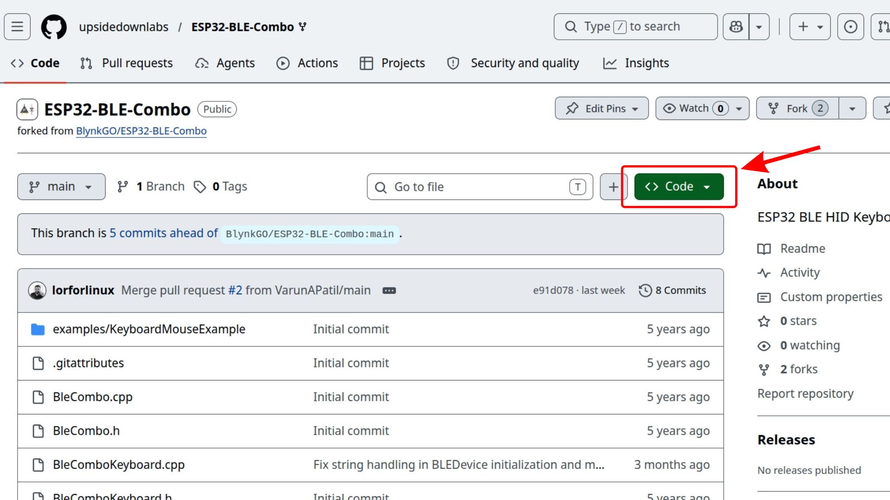

   Click the green "Code" button to open the download dropdown

From the dropdown, click **Download ZIP**. Your browser will download a `.zip` archive of the entire repository to your computer (usually to the Downloads folder).

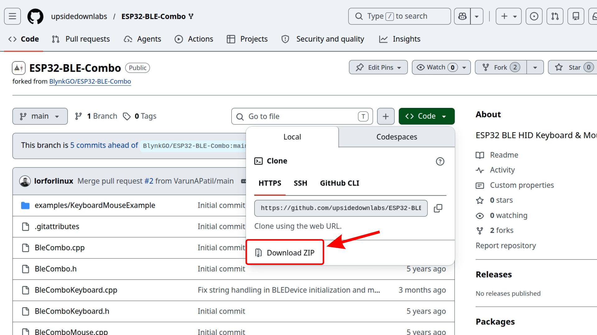

   Select "Download ZIP" from the dropdown

.. note::

   Do not unzip the file. Arduino IDE needs the file in its original `.zip` format to install it correctly.

Step 3: Open Arduino IDE
==========================

Launch Arduino IDE on your computer. Wait for it to fully load before proceeding.

   Arduino IDE ready to use

Step 4: Click on "Sketch" in the Menu Bar
============================================

In the Arduino IDE menu bar at the top, click on **Sketch**. A dropdown menu will appear.

   Click on "Sketch" in the menu bar

Step 5: Hover Over "Include Library"
=======================================

In the dropdown, move your mouse over **Include Library**. A submenu will slide out to the right.

   Hover over "Include Library" to open the submenu

Step 6: Click "Add .ZIP Library..."
======================================

From the submenu, click **Add .ZIP Library...**. A file picker dialog will open.

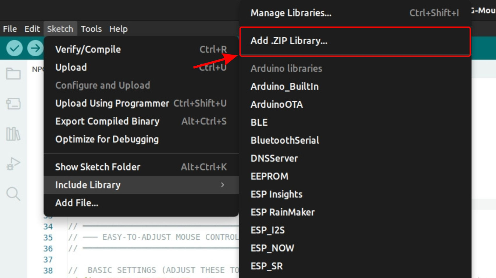

   Click "Add .ZIP Library..." from the submenu

Step 7: Select the Downloaded ZIP
====================================

In the file picker dialog, navigate to the location where you saved the downloaded ZIP file (typically the Downloads folder). Select the ZIP file and click **Open** (or **Choose** on macOS).

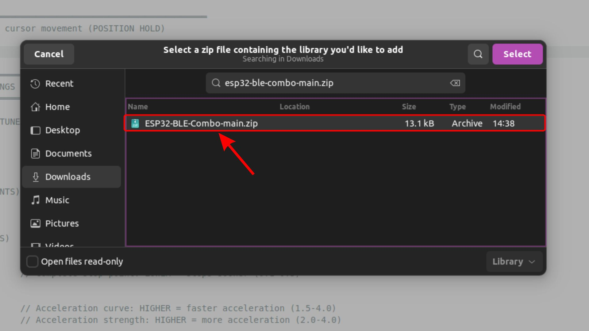

   Select the downloaded ZIP file and click Open

Arduino IDE will install the library. You should see a success message at the bottom of the IDE window:

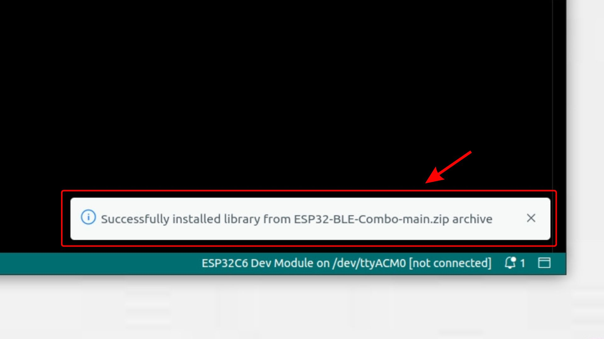

   "Library installed" confirmation shown at the bottom of Arduino IDE

Step 8: Verify the Installation
==================================

To confirm the library was installed correctly, click **Sketch** > **Include Library** in the menu bar. Scroll down till the end, under the contributed library, look for **ESP32 BLE Combo Keyboard Mouse**.

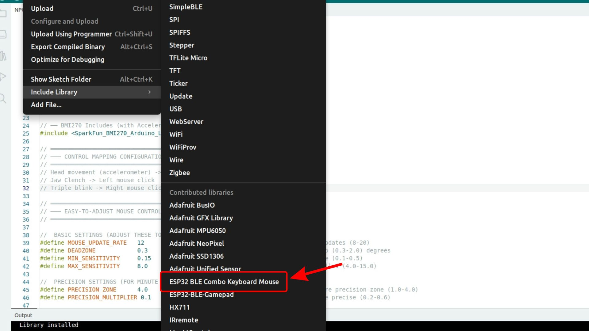

   The installed library appears at the bottom of the Include Library list

Now that you have followed all the steps, your ESP32 BLE Combo Keyboard Mouse library is included in your Arduino globally, and you can use it in any of your sketches by including it at the top of your code:

.. code-block:: cpp

   #include <BleCombo.h>

Troubleshooting
*****************

**The library does not appear in the list after installation**
   Close and reopen Arduino IDE, then check the list again. If it is still missing, repeat the Add .ZIP Library step.

**"No valid library found in the ZIP" error**
   This usually means the ZIP was extracted and re-compressed before installation. Download the ZIP fresh from GitHub without unzipping it first, then try to include it again. This issue may or may not happen on your system. This is because some operating systems automatically extract ZIP files when you download them, and if you then re-zip the extracted folder, it may not have the correct structure that Arduino IDE expects.

**The ZIP failed to download**
   Try refreshing the GitHub page and clicking Download ZIP again. If the repository is private, make sure you are logged into GitHub and have access.

.. seealso::

   - :ref:`resolve-software-issues` for general Arduino IDE troubleshooting tips.
   - :ref:`upsidedownlabs_contribute` to understand how you can contribute to us.
