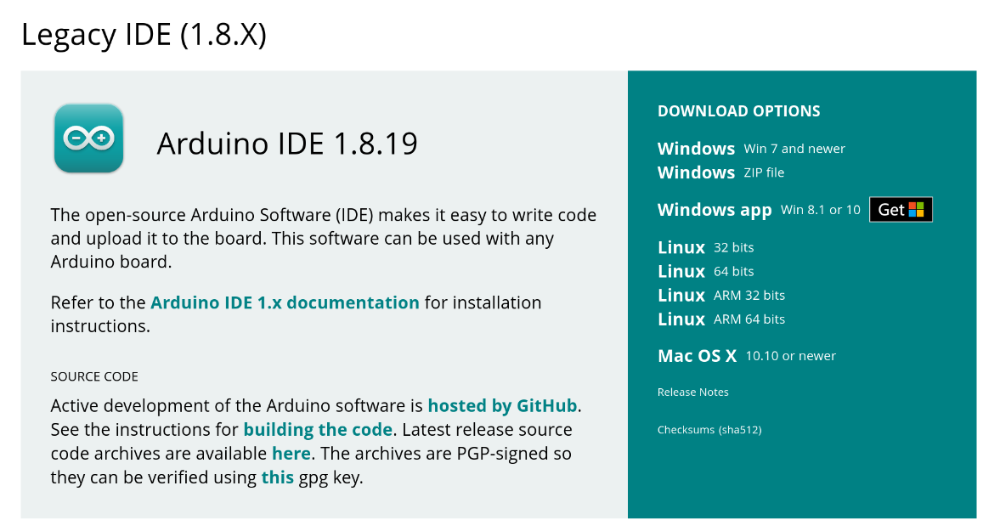

.. _muscle-bioamp-candy:

Muscle BioAmp Candy
#####################

Overview
*********

A candy-size single-channel ElectroMyography (EMG) sensor for recording of muscle signals 
at an affordable cost. It is an SMD version of :ref:`muscle_bioamp-biscute` that can be used to make 
amazing Human-Computer Interface (HCI) projects.

.. figure:: media/Muscle-BioAmp-Candy-front.*
    :width: 800
    :align: center

Features & Specifications
*****************************

+-----------------------+------------------------------------------------------------------------------------------------------------------------------------------------------------------+
| Minimum Input Voltage | 3.3-30 V                                                                                                                                                         |
+-----------------------+------------------------------------------------------------------------------------------------------------------------------------------------------------------+
| Input Impedance       | 10^11 ohm                                                                                                                                                        |
+-----------------------+------------------------------------------------------------------------------------------------------------------------------------------------------------------+
| Fixed Gain            | x2420                                                                                                                                                            |
+-----------------------+------------------------------------------------------------------------------------------------------------------------------------------------------------------+
| Bandpass filter       | 72 – 720 Hz                                                                                                                                                      |
+-----------------------+------------------------------------------------------------------------------------------------------------------------------------------------------------------+
| Compatible Hardware   | Any development board with an ADC (Arduino UNO & Nano, Adafruit QtPy, STM32 Blue Pill, BeagleBone Black, Raspberry Pi Pico, to name just a few)                  |
+-----------------------+------------------------------------------------------------------------------------------------------------------------------------------------------------------+
| BioPotentials         | EMG (Electromyography)                                                                                                                                           |
+-----------------------+------------------------------------------------------------------------------------------------------------------------------------------------------------------+
| No. of channels       | 1                                                                                                                                                                |
+-----------------------+------------------------------------------------------------------------------------------------------------------------------------------------------------------+
| Electrodes            | 3 (Positive, Negative, and Reference)                                                                                                                            |
+-----------------------+------------------------------------------------------------------------------------------------------------------------------------------------------------------+
| Dimensions            | 3.5 x 1.5 cm                                                                                                                                                     |
+-----------------------+------------------------------------------------------------------------------------------------------------------------------------------------------------------+
| Open Source           | Hardware + Software                                                                                                                                              |
+-----------------------+------------------------------------------------------------------------------------------------------------------------------------------------------------------+

Hardware
**********

Images below shows a quick overview of the hardware design.

.. grid:: 1 1 2 2
    :margin: 4 4 0 0 
    :gutter: 2

    .. grid-item::
        
        .. card::

            **PCB Front**
            ^^^^^
            .. figure:: media/PCBfront.*

    .. grid-item::
        
        .. card::

            **PCB Back**
            ^^^^^
            .. figure:: media/PCBback.*

.. figure:: media/muscle-bioamp-candy-front.*
    :align: center
.. figure:: media/muscle-bioamp-candy-back.*
    :align: center
.. figure:: media/dimensions.*
    :align: center

    **PCB Layout**

.. figure:: media/schematic.*
    :align: center

    **Schematic Diagram**

Contents of the kit
********************

.. image:: media/kit-contents.*

Software requirements
**********************

- Before you start using the kit, please download `Arduino IDE v1.8.19 (legacy IDE) <https://www.arduino.cc/en/software>`_. Using this you'll be able to upload the arduino sketches on your development board and visualise the data on your laptop.
    

Using the kit
****************

Step 1: Connect Arduino UNO R3
=================================

.. image:: media/arduino-candy-connection.*

Connect `VCC` to either `5V` or `3.3V`, `GND` to `GND`, and `OUT` to `Analog pin A0` of your Arduino UNO via jumper cables provided by us. If you are connecting OUT to any other analog pin, then you will have to change the `INPUT PIN` macro in the example arduino sketch accordingly.

.. note:: For demonstration purposes we are showing connections of the sensor with Arduino UNO R3 but you can use any other development board or a standalone ADC of your choice.

.. warning:: Take precautions while connecting to power, if power pins (GND & VCC) are to be swapped, your sensor will be fried and it’ll become unusable (DIE).

Step 3: Connecting electrode cable
========================================

.. image:: media/candy-cable-connection.*

Connect the BioAmp cable to Muscle BioAmp Candy by inserting the cable end in the JST PH connector as shown above.

Step 4: Skin Preparation
===============================================

Apply Nuprep Skin Preparation Gel on the skin surface where electrodes would be placed to remove dead skin cells and clean the skin from dirt. After rubbing the skin surface thoroughly, clean it with an alcohol wipe or a wet wipe.

For more information, please check out detailed step by step :ref:`skin-preparation`

Step 5: Measuring EMG (ElectroMyoGraphy)
===============================================

We have 2 options to measure the EMG signals, either using the gel electrodes or using dry electrode based Muscle BioAmp Band. You can try both of them one by one.

- **Using gel electrodes:**

1. Connect the BioAmp cable to gel electrodes,
2. Peel the plastic backing from electrodes
3. Place the IN+ and IN- cables on the arm near the ulnar nerve & REF (reference) at the back of your hand as shown in the connection diagram.

.. image:: media/candy-emg.*

- **Using Muscle BioAmp Band:**

1. Connect the BioAmp cable to Muscle BioAmp Band in a way such that IN+ and IN- are placed on the arm near the ulnar nerve & REF (reference) on the far side of the band.
2. Now put a small drop of electrode gel between the skin and metallic part of BioAmp cable to get the best results.

   **Tutorial on how to use the band:**

.. youtube:: xYZdw0aesa0
    :align: center
    :width: 100%

.. note:: In this demonstration we are recording EMG signals from the ulnar nerve, but you can record EMG from other areas as well (biceps, triceps, legs, jaw etc) as per your project requirements. Just make sure to place the IN+, IN- electrodes on the targeted muscle and REF on a bony part.

**Uploading the code:**

Connect your Arduino UNO R3 to your laptop using the USB cable (Type A to Type B). Copy paste any one of the arduino sketches given below in Arduino IDE v1.8.19 that you downloaded earlier:
    
EMG Filter: https://github.com/upsidedownlabs/Muscle-BioAmp-Arduino-Firmware/blob/main/2_EMGFilter/2_EMGFilter.ino

EMG Envelope: https://github.com/upsidedownlabs/Muscle-BioAmp-Arduino-Firmware/blob/main/3_EMGEnvelope/3_EMGEnvelope.ino

Go to **"tools"** from the menu bar, select **"board"** option then select Arduino UNO. In the same menu, 
select the COM port on which your Arduino Uno is connected. To find out the right COM port, 
disconnect your board and reopen the menu. The entry that disappears should be the 
right COM port. Now upload the code, & open the serial plotter from the tools menu to visualize 
the EMG signals. 

After opening the serial plotter make sure to select the baud rate to 115200.

.. warning:: Make sure your laptop is not connected to a charger and sit 5m away from any AC appliances for best signal acquisition.

**Visualizing the EMG signals**

Now flex your arm to visualize the muscle signals in real time on your laptop.

.. image:: media/using-candy.*

**Video tutorial:**

.. youtube:: lPX2TGBcHOA
    :align: center
    :width: 100%

