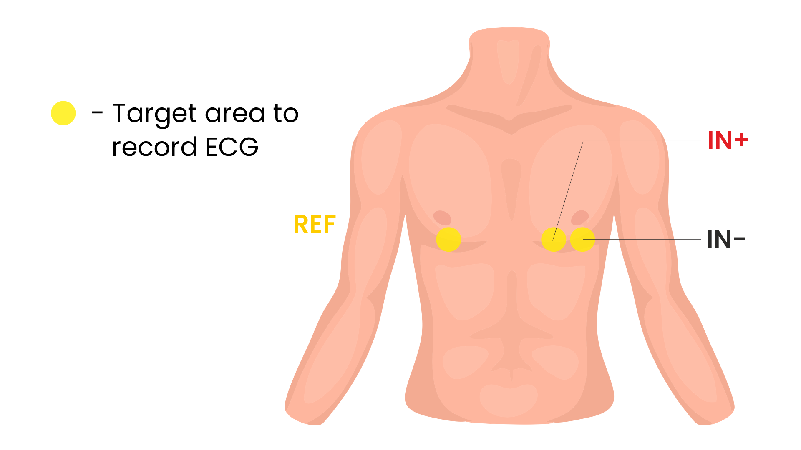

.. _heart-bioamp-arduino-firmware:

Heart (ECG) BioAmp Arduino Firmware
#####################################

What is Electrocardiography (ECG)?
========================================

Electrocardiography `[1] <https://www.mayoclinic.org/tests-procedures/ekg/about/pac-20384983>`_ is the process of 
producing an electrocardiogram (ECG or EKG), a recording of the heart's 
electrical activity through repeated cardiac cycles.
It is an electrogram of the heart which is a graph of voltage versus time of the electrical activity 
of the heart using electrodes placed on the skin. These electrodes detect the small electrical 
changes that are a consequence of cardiac muscle depolarization followed by repolarization during 
each cardiac cycle (heartbeat).

To know more about EEG `visit here <https://en.wikipedia.org/wiki/Electroencephalography>`_.

**Who is this for?**

Anyone who's using the BioAmp Hardware for the very first time — whether you're a student, hobbyist, educator or just curious. No experience needed!

👉 To learn about our BioAmp Hardware checkout :ref:`the hardware page <upsidedownlabs_hardware_home>`.

Step-by-Step Setup Guide
===========================

With the hardware in your hands, you're just a few steps away from unlocking its full potential — let's get the software set up!

**Step 1: Downloading GitHub Repository for Hardware**

- This is the code your Arduino needs to read Heart (ECG) signals.
- You have two easy ways to get the code that will help you read your EOG signals:

.. dropdown:: Simply Download (recommended for beginners)
    :open:

    - Go to the GitHub page: `Heart BioAmp Arduino Firmware <https://github.com/upsidedownlabs/Heart-BioAmp-Arduino-Firmware>`_
    - Click the green “**Code**” button > Download ZIP
    - Unzip the folder and save it somewhere easy to find.

.. dropdown:: Clone using Git (for tech-savvy users)

      - Install Git for your OS: https://git-scm.com/
      - Clone this GitHub repository using
      
        .. code-block:: bash
            
            git clone https://github.com/upsidedownlabs/Heart-BioAmp-Arduino-Firmware

**Step 2: Application Required**

Before you start using the kit, please download or open the following: 

1. **Arduino IDE** 
   
   - We need Arduino IDE to upload code to your Arduino board
   - Link to download IDE for your OS: https://www.arduino.cc/en/software

2. **Chords Website**
   
   - We will use Chords Website to visualize the Eye Signals!
   - Open this website: `Chords Web <https://chords.upsidedownlabs.tech>`_

.. _Connect Your Hardware:

**Step 3: Connect Your Hardware**

1. Plug the Hardware into your Arduino UNO using jumper wires.
2. Follow the exact wiring diagram from the :ref:`hardware documentation <upsidedownlabs_hardware_home>` of the hardware you are using.
3. Hardwares that are compatible with Eye BioAmp Firmware:
   
   - :ref:`Bioamp EXG Pill <bioamp-exg-pill>`
   - :ref:`Heart BioAmp Candy <heart-bioamp-candy>`
   - :ref:`Muscle BioAmp Shield <muscle-bioamp-shield>`

It’s just like putting together a puzzle!

**Step 4: Skin Preparation and Electrodes Placement**

- **Using Gel Electrodes:**

1. **Prepare your skin**

   - Choose the area where you'll place the electrodes.
   - Wipe the chest area using **an alcohol swab** or **Nuprep Gel** to remove oils and dead cells — this improves signal clarity.

   .. note::

      Need help with skin prep? Check out the full guide here: :ref:`Skin Preparation Guide <skin-preparation>`

2. Attach the wires to the electrodes, then attach the electrodes to skin (refer diagram below):
   
   - ``IN+`` (positive): Left side of chest, closer to the heart
   - ``IN–`` (negative): Left side of the chest , just under the collarbone, near to positive electrode.
   - ``REF`` (reference): Right side of chest, far from the heart (over the ribs)

    :align: center
    :alt: ECG Placement

    ECG Placement

.. _How to upload the Code to Arduino:

**Step 5: How to upload the Code to Arduino**

1. Open the folder you downloaded: **Heart-BioAmp-Arduino-Firmware**
2. Inside that, you’ll find several subfolders.
3. Pick the folder for the experiment you want to try. (For beginners: start with the first one and move step-by-step through the others for a better learning experience )
4. Inside that folder, open the **.ino** file using **Arduino IDE**
   
- For example:

  - To try raw signal: open ``1_FixedSampling.ino``
  - To try filtered signal: open ``2_ECGFilter.ino``

.. note::
    You'll find all the experiments listed below, each with :ref:`step-by-step instructions<experiments step by step>`. Just scroll to the one you're working on to get started with the right setup.
   
5. Connect Your Arduino

   - Plug your Arduino board into your computer’s USB port using the USB cable.
   - Wait for the operating system to install any required USB drivers.

6. In Arduino IDE:

   - Go to **Tools > Board > Arduino UNO** choose the model of your board (e.g., “Arduino Uno” or “Arduino Nano” if you wired to a Nano)
   - Go to **Tools > Port > [select the correct COM port]**

7.	Verify (Compile) the Sketch

        - Click the **“✔️ Verify”** button (or press ``Ctrl + R``).
        - Wait for **“Done compiling.”** If errors appear, double-check you opened the correct .ino file.

8.  Click the **✓** Upload (or press ``Ctrl + U``) button to send the code to your Arduino.  

    - The IDE will compile again and then send the code to your board.
    - The onboard LED labeled **“L”** may blink during upload. When you see **“Done uploading”**, the new firmware is running.

9. Open Serial Monitor and Serial Plotter (Optional)

   - For serial monitor and plotter, we recommend using `Chords Web <https://chords.upsidedownlabs.tech>`_. However, if you're learning to develop, you might also find these options useful.

   - For Serial Monitor: In the IDE, click **Tools → Serial Monitor** (or press ``Ctrl + Shift + M``).
   - Ensure the baud rate at the bottom right of the Serial Monitor is set to ``115200`` (or whatever the sketch’s Serial.begin(115200); line specifies).
   - You should start seeing lines of numbers. Those are your readings.

   - For Serial Plotter: In the IDE, click **Tools → Serial Plotter**.
   - You should start seeing plotting of graph and visualize the waves.

.. important::

    - Remember to close the **Serial Monitor & Serial Plotter** in **Arduino IDE** before starting the Chords Visualizer.

.. _Visualize Your Heart Signals!:

**Step 6: Visualize Your Heart Signals!**

1. Open this website: `Chords Web <https://chords.upsidedownlabs.tech>`_
2. Click: Visualize Now → then choose Serial Wizard.
3. Select the correct COM port (same one from Arduino IDE).
4. Click Connect.

.. important::

    - Always **disconnect your laptop charger** while testing. Why? Charging can introduce 50 Hz noise that affects the signal.

🎉 Now 

    
.. _experiments step by step:

Let's explore all the experiments step by step
===============================================
.. Experiment 1

.. dropdown:: 1. Fixed Sampling
    :open:
    
    **1. Program Purpose & Overview**

    The **Fixed Sampling** program reads the raw electrical signal of your heart (ECG) 
    using an analog pin and prints it to the Serial Monitor. It's useful for understanding 
    what the unfiltered heart signal looks like. Think of it like looking at the "raw ingredients" before cooking.

    **2. How It Works**

    - ``analogRead(A0)`` reads voltage from the Eye BioAmp sensor.
    - ``Serial.println()`` prints those values to the computer.
    - A timer ensures values are read at a steady rate.

    You can see how heart beats changes the waveform.
    
    **3. Perform the Hardware**
    
    - Refer to wiring as per instructions given in :ref:`Connect Your Hardware<Connect Your Hardware>`

    **4. Firmware Upload**

    - For this project, navigate to the repository folder (Heart-BioAmp-Arduino-Firmware/1_FixedSampling) and select ``1_FixedSampling.ino``.
    - To upload firmware, refer to :ref:`How to upload the Code to Arduino<How to upload the Code to Arduino>`
    
    **5. Visualize your signal**

    - Follow the steps given in :ref:`Visualize Your Heart Signals!<Visualize Your Heart Signals!>` 
  
    **6. Running & Observing Results**

    - A stream of numbers.
    - Looking up/down → sudden voltage change.
    - Blinks → sharp spikes.

    Checkout Demo Visualization on **YouTube**:

    .. youtube:: Txo7DjUr5Tk
    
    .. note::
        To learn more about this project, visit our Instructables page: `Visualizing Electrical Impulses of Eyes (EOG) Using BioAmp EXG Pill <https://www.instructables.com/Visualizing-Electrical-Impulses-of-Eyes-EOG-Using-/>`_

.. dropdown:: 2. ECG Filter

    For detailed guide, visit our **Instructables Page**: `Record Publication Grade ECG at Your Home Using BioAmp EXG Pill <https://www.instructables.com/Record-Publication-Grade-ECG-at-Your-Home-Using-Bi/>`_

.. dropdown:: 3. Heart Rate Detection

    For detailed guide, visit our **Instructables Page**: `Measuring Heart Rate Using BioAmp EXG Pill <https://www.instructables.com/Measuring-Heart-Rate-Using-BioAmp-EXG-Pill/>`_

.. dropdown:: 4. Heart Beat Detection

    For detailed guide, visit our **Instructables Page**: `Detecting Heart Beats Using BioAmp EXG Pill <https://www.instructables.com/Detecting-Heart-Beats-Using-BioAmp-EXG-Pill/>`_

.. dropdown:: 6. OLED BPM

    The 

    For detailed guide, visit our **Instructables Page**: `Heartrate on OLED Display in Real Time <https://www.instructables.com/Heartrate-on-OLED-Display-in-Real-Time/>`_

 

