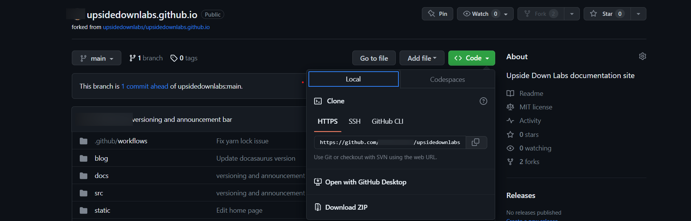
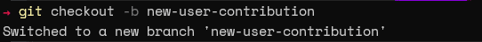

# EXPLORE AND CONTRIBUTE

You can’t simply download the project, make some modifications and upload the changes to an open-source project. There is a specific workflow one should follow when contributing to a project in GitHub. So let's look at the correct way to contribute. We will be using the GitHub first-contributions repository in this tutorial.

## Here, Are the Steps to contribute to the Repository
<!-- 
```js
console.log('Every repo must come with a mascot.');
``` -->


## Step 1: Fork the main repository

Forking will create a copy of the project in your own GitHub account. It allows the users to make any changes to the code while ensuring that these changes do not affect the original repository. Simply click the Fork button on the project repository.


If the forking is successful, it will create a new repo under your account.


## Step 2 - Clone the forked repository to your machine
Next, you need to clone your forked repo to your local machine to develop the project. Click on the Code icon and select your preferred cloning method. Here, we will use the HTTPS link with the git clone command.
Cloning copies the repository files (and commit history) from GitHub to your local machine. The repository will be downloaded into a subdirectory of your working directory, and the subdirectory will have the same name as the repository.



Run the clone command in your local environment:

```js
git clone  https://github.com/upsidedownlabs/upsidedownlabs.github.io.git;
```

## Step 3 - Download Node.js

Download Node to get started with npx tools

[Node.js](https://nodejs.org/en/download)

## Step 4 - Getting Started with npx

```js
npm install npx
```


## Step 5 - Create A New Branch
While making any change to the code, a best practice is to create a new feature branch for the changes we need to make. This ensures that we keep the master branch clean, and are able to simply revert our code or make updates when necessary.

Switch to the directory that was created after you cloned the forked repository:


```js
cd <new branch name>
```

Create a new feature branch with a name that identifies with the changes you are planning to do. For example:
```js
git checkout -b new-user-contribution
```




## Step 6- 
Run the following command in the terminal 
```js
npm start
```


## Step 7 - Develop, Stage, and Commit
If you have created any new files as part of your change, you will need to add it to the branch you just created.
```js
git add <filename>
```
For all the changes made, you have to commit them to the branch. Make sure you add a valid commit message (as per the conventions of the project):

```js
git commit -m "Add XYZ to filename"
```
Image description

## Step 8 - Push the Changes
The committed changes still reside only in your local environment. Therefore, you need to push these changes to the forked GitHub repository in your account. It can be achieved by using the git push command.

```js
git push origin fix-npe-issue
```


The workflow from git add, git commit to git push will be similar across all development environments. It is the standard way to deliver changes to any git repository regardless of the provider.

## Step 9 - Create a Pull Request
If pushing is successful, you should see a message indicating the new push with the "Compare and pull request" button when visiting the GitHub repository. Click on that button to make a pull request.

<!-- Image description -->


It will generate a pull request that directly targets the original repository. If you look at the request, you can see that the changes from the new-user-contribution branch of your forked repository will be merged to the master branch of the original repository.

It's generally a good practice to leave a comment indicating the changes or the reason for the pull request.
<!-- 
Image description -->

Finally, click on the "Create pull request" button to create the request. It will navigate the user to the newly created pull request in the original repository. In this case, the pull request will be created in the first-contributions repository.
<!-- 
Image description -->

<!-- That's it, and you have successfully contributed your changes to an open-source project. However, your changes are still not accepted and merged to the original repository. Your changes need to be first verified by the repository maintainers. They will only be merged into the repository after the maintainers approve the request. -->


