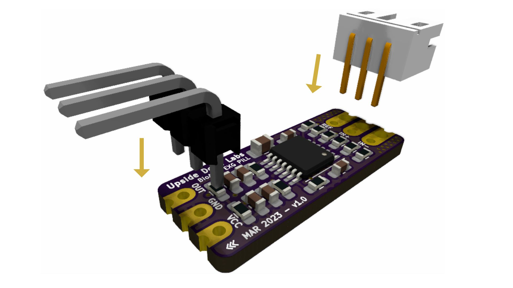

# EEG Experiments

# Recording EEG From Pre Frontal Cortex of Brain Using BioAmp EXG Pill

In this project we will be recording brainwaves or EEG from prefrontal cortex part of the brain using Arduino Uno and BioAmp EXG Pill.

## What is Electroencephalography (EEG)?

An electroencephalogram (EEG) is a test used to evaluate the electrical activity in your brain. It can help detect potential problems with brain cell communication.

## About BioAmp EXG Pill:

BioAmp EXG Pill is one of a kind pill-size chip that can record publication-grade biopotential signals from your body be it from the heart (ECG), brain (EEG), eyes (EOG), and muscles (EMG).

The entire BioAmp series of sensors from Upside Down Labs is designed in a way to teach you the basics of the instrumentation amplifier, active bandpass filtering, soldering, programming, neuroscience, HCI, and BCI just to name a few concepts.

# Supplies

## HARDWARE

1 x BioAmp EXG Pill (with JST PH 2.0 connector and a header pin)

1 x BioAmp Cable

3 x Gel Electrodes

3 x Jumper Cables

1 x Arduino Uno / Maker Uno with USB Cable (You can also use any other microcontroller board with an ADC)

1 x Nuprep Skin Preparation Gel

1 x Wet wipe

1 x Brain BioAmp Band (optional)

1 x Electrode Gel (only if using Brain BioAmp Band)

## SOFTWARE

1. Arduino IDE
2. Backyard Brains' Spike Recorder

**Note**: You can either get DIY Neuroscience Kit Basic or BioAmp EXG Pill Packs by clicking the links below:

DIY Neuroscience Kit Basic ([Upside Down Labs Store](https://store.upsidedownlabs.tech/product/diy-neuroscience-kit-basic/) |
[Tindie Store](https://www.tindie.com/products/upsidedownlabs/diy-neuroscience-kit-basic/) | [Amazon Store](https://www.amazon.in/dp/B0CBMTHLDJ?ref_=cm_sw_r_cp_ud_dp_E2A1CNJXN6ACZ4THA5ZQ))

BioAmp EXG Pill Pack ([Upside Down Labs Store](https://store.upsidedownlabs.tech/product/bioamp-exg-pill/) | [Tindie Store](https://www.tindie.com/products/upsidedownlabs/diy-neuroscience-kit-basic/) )

BioAmp EXG Pill - EXG Explorer Pack ([Upside Down Labs Store](https://store.upsidedownlabs.tech/product/bioamp-exg-pill/) |
[Tindie Store](https://www.tindie.com/products/upsidedownlabs/diy-neuroscience-kit-basic/) | [Amazon Store](https://www.amazon.in/dp/B0B29CCPQB?ref_=cm_sw_r_cp_ud_dp_4D6ZTBD5RRASS5QM6HK1))

**Disclaimer:** DIY Neuroscience Kit Basic includes everything you need for this project but BioAmp EXG Pill Packs does not include all the supplies and you will have to order them seperately from our stores.

## Step 1: Assembly

The BioAmp EXG Pill comes presoldered with DIY Neuroscience Kit Basic but in case you are getting BioAmp EXG Pill seperately then you will have to assemble it for this project by soldering the header pins and JST PH 2.0 connector as shown in the diagram.

## Step 2: Skin Preparation

Apply Nuprep Skin Preparation Gel on the skin surface where electrodes would be placed to remove dead skin cells and clean the skin from dirt. After rubbing the skin surface thoroughly, clean it with a wet wipe.

### About Nuprep Gel:
Nuprep skin preparation gel is a mildly abrasive, highly conductive gel that should be applied before placing the electrodes on the skin to improve measurements. When applied gently, it strips away the top layer of skin and moistens the underlying skin layer which reduces the skin impedance with minimal skin irritation and discomfort.

## Step 3: Connecting Electrode Cable

Connect the BioAmp Cable to BioAmp EXG Pill. We have different variants of the BioAmp Cable so don't go with the color coding and focus on the REF, IN+ and IN- written on the BioAmp EXG Pill.

## Step 4: Electrode Placements

Let's understand the electrode placements before moving forward in this project. For recording EEG from prefrontal cortex part of brain, you have to place the electrodes on your forehead, specifically on Fp1 and Fp2 refer International 10-20 system for recording EEG 

### What is International 10-20 system for recording EEG?

It is an internationally recognized method to describe and apply the location of electrodes in the context of an EEG exam or voluntary lab research. This method was developed to maintain standardized testing methods ensuring that a subject's study outcomes (clinical or research) could be compiled, reproduced, and effectively analyzed and compared using the scientific method.

### Options to measure EEG

So now we have 2 options to measure the EEG signals, either using the gel electrodes or using dry electrode based EEG band. You can try both of them one by one.

### Option 1 - Measuring EEG using Gel electrodes:

1. Connect the BioAmp Cable to gel electrodes,
2. Peel the plastic backing from electrodes
3. Place the IN+ and IN- cables on the forehead & REF (reference) at the bony part, on the back side of your earlobe as shown in the video above.

### Option 2 - Measuring EMG using Muscle BioAmp Band, a dry electrode based EMG band and gel electrode:

1. Connect the BioAmp Cable to Brain BioAmp Band in a way such that IN+ and IN- are placed on the forehead.
2. In this case, the REF (reference) should be connected using gel electrode. So connect the reference of BioAmp Cable to the gel electrode, peel the plastic backing and place it at the bony part, on the back side of your earlobe.
3. Now put a small drop of electrode gel on the dry electrodes (IN+ and IN-) between the skin and metallic part of BioAmp Cable to get the best results.

## Step 5: Connections

Connect BioAmp EXG Pill to Arduino Uno using the jumper cables as directed below:

1. VCC to 5V
2. GND to GND
3. OUT to A0

## Step 6: Download Arduino IDE

Download the Arduino IDE from the link given below:

[Ardiuno IDE](https://www.arduino.cc/en/software)

(We have used Arduino IDE version 1.8.19 for this project)

After downloading, connect the Arduino Uno to your laptop using the USB Cable (Type A to Type B)

**Note**: Make sure your laptop is not connected to a charger and sit 5m away from any AC appliances for best signal acquisition.

## Step 7: Download Spike Recorder

Download Backyard Brains' Spike Recorder according to the operating system you are using (Windows, OSX, Linux) from the link given below:

https://backyardbrains.com/products/spikerecorder

After installing the software, just copy paste the Spike Recorder Arduino Code by clicking the link below in Arduino IDE, save the file and flash it on the Arduino Uno.

Spike Recorder Arduino Code: https://raw.githubusercontent.com/BackyardBrains/SpikerShield/master/Muscle/Arduino%20Code/SpikeRecorder/SpikeRecorderSpikerShield_V1_1.ino

Now start the Spike Recorder.

## Step 8: Configurations on Spike Recorder

When the Spike Recorder starts, it will start recording from your microphone. To change that, go to the settings by clicking the first icon on the top left corner of the screen, select the COM port of your Arduino Uno and click on connect.

Also mute the speakers and apply the 50Hz notch filter by clicking on the checkbox as shown in the screenshot above.

You should set the low band pass filter to 1Hz and high bandpass filter to 40Hz as we are only recording the EEG singnals which range between these frequencies.

Now everything is configured and connected. So close the settings window and start recording EEG signals.

## Step 9: Visualizing EEG

<iframe width="100%" height="444" src="https://www.youtube.com/embed/QzZh243-Ac8?feature=oembed&autoplay=1" title="YouTube video player" frameborder="0" allow="accelerometer; autoplay; clipboard-write; encrypted-media; gyroscope; picture-in-picture; web-share" allowfullscreen></iframe> 

The signals that you can see on the screen right now are originating from prefrontal cortex part of your brain and propagating through all the layers to the surface of your skin.

To record these EEG signals, you have placed the electrodes on the forehead, then BioAmp EXG Pill is amplifying those signals so that we can detect it and finally sending it to the ADC (Analog to Digital Convertor) of your Arduino Uno. Ultimately the signals are being visualized in Spike Recorder software.

We hope everything is clear now and you understand how the signals are propagating from your brain to the screen of the laptop.

** Features of Spike Recorder that you can explore:**

1. Increase or decrease the scale of the Y axis by clicking on the + and - icons respecitively that is present on the left side of the graph.
2. Increase or decrease the X axis timescale by sliding up and down on the scroll wheel of the mouse.
3. Visualize the FFT graph by clicking on the FFT icon on top left size of the screen.
4. Record the data in .wav format by clicking the record icon on the top right corner. You can convert this data in any other format according to your project requirements.
5. Listen to the signals by clicking the volume icon on the top right corner. No don't smile right now, that's how your brain sounds like :P
It was a very basic project, but now we think you are all set to explore on your own and make amazing BCI projects. Let us know your feedback in the comments and feel free to ask any questions.

You can also mail us at support@upsidedownlabs.tech for any kind of support while you are making this project.